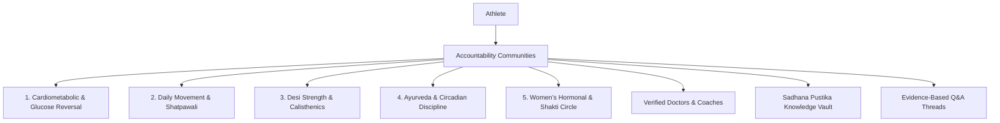

# Accountability Communities (Thematic Mandalas & Peer Wisdom)

## 1. Overview & Cultural Philosophy
The **Accountability Communities** module (`AccountabilityCommunitiesScreen`) organizes athletes into purpose-driven thematic health circles (**Mandalas / साधक मंडल**). Unlike superficial social media groups, FitKarma Mandalas are outcome-driven ecosystems anchored by verified Indian health professionals (Ayurvedic Physicians & CSCS Biomechanics Coaches) and backed by the real-time **Community Pulse Index**.

---

## 2. Thematic Mandala Categories

### Supported Mandalas:
1. **100-Step Shatpawali Sadhana Circle**: Post-meal mindful walking discipline and digestive fire (*Jatharagni*) optimization.
2. **Insulin Sensitivity & Pre-Diabetes Reversal**: South Asian low-glycemic dietary templates and glucose curve stabilization.
3. **Desi Strength & Calisthenics Guild**: Traditional Baithak, Dand, and progressive barbell overload mechanics.
4. **Ayurveda & Circadian Discipline**: Brahma Muhurta, Dosha equilibrium, and Dinacharya adherence.
5. **Women's Hormonal & Shakti Circle**: Cycle-synced training, PCOS metabolic recovery, and stress resilience.

---

## 3. Mathematical Foundations

### Community Pulse Score ($P_{\text{community}} \in [0, 100]$)
$$P_{\text{community}} = (0.50 \cdot \bar{A}_{\text{members}}) + \left(0.30 \cdot \min\left(1.0, \frac{N_{\text{threads}}}{20}\right) \times 100\right) + (0.20 \cdot R_{\text{mentor}})$$

Where:
- $\bar{A}_{\text{members}}$: 30-day average adherence rate across all active community members ($0 - 100$).
- $N_{\text{threads}}$: Daily active discussion questions answered.
- $R_{\text{mentor}}$: Verified mentor response rate percentage ($0 - 100$).

---

## 4. Source Files Reference
- **Domain Models**: [`lib/features/social/domain/community_models.dart`](file:///f:/fitkarma/lib/features/social/domain/community_models.dart)
- **Deterministic Engine**: [`lib/features/social/domain/community_engine.dart`](file:///f:/fitkarma/lib/features/social/domain/community_engine.dart)
- **State Provider**: [`lib/features/social/presentation/providers/community_provider.dart`](file:///f:/fitkarma/lib/features/social/presentation/providers/community_provider.dart)
- **UI Screen**: [`lib/features/social/presentation/communities_screen.dart`](file:///f:/fitkarma/lib/features/social/presentation/communities_screen.dart)

---

## 5. Offline Verification & Security Rules
- **100% Offline Capability**: All community filtering, pulse score computations, and knowledge vault resources are cached and operable offline.
- **Firestore Security Rules**: Protected under `/communities/{communityId}` and `/communities/{communityId}/discussions/{threadId}` with author verification for writes and open authenticated reads.
