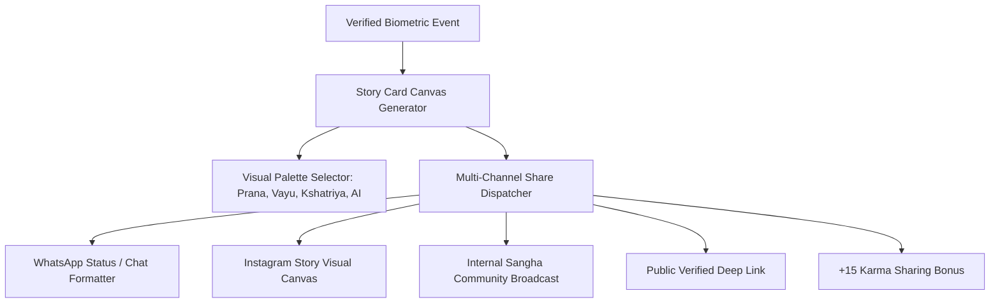

# Activity Feed & Sharing Architecture (Sadhana Patra & Social Contagion)

## 1. Overview & Cultural Philosophy
The **Activity Feed & Sharing Architecture** (`ActivitySharingScreen`) is FitKarma's celebration engine. It enables athletes to turn their authentic daily discipline into **Positive Social Contagion (सकारात्मक प्रेरणा)**. Athletes can generate high-resolution visual story cards and formatted WhatsApp/Instagram payloads celebrating streaks, PRs, and biometric risk reversals.

---

## 2. Visual Architecture & Component Flow

### Key UI Sections:
- **Story Card Canvas Preview**:
  - Displays primary metric hero typography, biometric verification pill (Apple Health / Vision AI Loop), and celebration headlines in English and Hindi.
- **Visual Palette Theme Selector**:
  - `karmaGreen` (*Prana Green*), `focusBlue` (*Vayu Blue*), `kshatriyaGold` (*Kshatriya Gold*), `aiPurple` (*Groq AI Purple*).
- **Multi-Channel Share Action Grid**:
  - Instant formatting, copying, and broadcasting with interactive user feedback.
- **Viral Contagion Index**:
  - Real-time rating ($C_v$) measuring the athlete's positive social contagion impact.

---

## 3. Mathematical Foundations

### Viral Contagion Index ($C_v \in [0, 100]$)
$$C_v = \min(60, N_{\text{shares}} \times 12.5) + \min\left(40, \frac{K_{\text{earned}}}{500} \times 40\right)$$

Where:
- $N_{\text{shares}}$: Total verified milestone broadcasts to external channels.
- $K_{\text{earned}}$: Cumulative Karma bonus awarded through sharing activity.

---

## 4. Source Files Reference
- **Domain Models**: [`lib/features/social/domain/sharing_models.dart`](file:///f:/fitkarma/lib/features/social/domain/sharing_models.dart)
- **Deterministic Engine**: [`lib/features/social/domain/sharing_engine.dart`](file:///f:/fitkarma/lib/features/social/domain/sharing_engine.dart)
- **State Provider**: [`lib/features/social/presentation/providers/sharing_provider.dart`](file:///f:/fitkarma/lib/features/social/presentation/providers/sharing_provider.dart)
- **UI Screen**: [`lib/features/social/presentation/activity_sharing_screen.dart`](file:///f:/fitkarma/lib/features/social/presentation/activity_sharing_screen.dart)

---

## 5. Offline Verification & Security Rules
- **100% Offline Capability**: Card layout generation, palette customization, and text formatting execute completely offline in pure Dart.
- **Firestore Security Rules**: Public feed broadcasts are validated under `/publicFeed/{feedId}` with author verification for writes and open authenticated reads.
