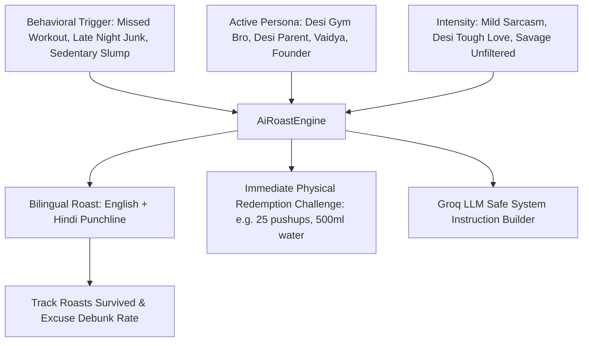

# AI Roast & Tough Love Mode

## 1. Overview & Cultural Accountability Philosophy
The **AI Roast Mode** (`AiRoastScreen`) delivers culturally resonant, humorous Indian tough love, witty sarcasm, and zero-excuse behavioral accountability.

Designed as an opt-in motivational dynamic, it challenges common excuses (snoozed alarms, late-night Swiggy/Zomato binges, sedentary screen slumps, dehydration) with relatable Desi humor, while always pairing roasts with **immediate physical redemption challenges**.

Key Architecture & Personas:
- **Desi Gym Bro (अखाड़ा गुरु)**: *"Bhai alarm bajne ke baad 45 minute reel dekhne se bicep nahi bante!"*
- **Strict Desi Parent (शर्मा जी के पापा)**: *"Sharma ji ka beta subah 5 baje 5k daud ke padh bhi raha hai!"*
- **Sarcastic Ayurvedic Vaidya (कटुभाषी वैद्य)**: *"Lagta hai Kapha dosha itna badh gaya hai ki bistar ne tumhe adopt kar liya!"*
- **Unforgiving Startup Founder**: *"Excuses don’t scale, execution does. Fix your baseline telemetry."*

---

## 2. Roast Pipeline Architecture

### Roast Personas & Tones:
| Persona | Catchphrase | Primary Focus |
| :--- | :--- | :--- |
| **Desi Gym Bro** | *Bhai form dekh, phone nahi!* | Gym discipline, skipping workouts & reel addiction |
| **Strict Desi Parent** | *Sharma ji ke bete ko dekha hai?* | Early rising, consistency & comparison accountability |
| **Sarcastic Vaidya** | *Pitta bhadak gaya hai tera!* | Late-night junk binging, digestive sluggishness & posture |
| **Corporate Hustler** | *Excuses don’t scale, execution does.* | High-stress sedentary desk slumps & low hydration |

---

## 3. Ethical Guardrails & Safety
- **Strictly Behavioral**: Targets habits, procrastination, and excuses—never personal identity, physical appearance, or body composition.
- **Zero Abuse / Hate Speech**: Curated filter rules and strict LLM system prompts prevent derogatory language or body shaming.
- **Redemption-Driven**: Every roast concludes with an instant, positive physical action to regain momentum and earn Karma points.
- **1-Tap Opt-Out**: Users can disable Roast Mode at any time.

---

## 4. Source Files Reference
- **Domain Models**: [`lib/features/festival_life_events/domain/ai_roast_models.dart`](file:///f:/fitkarma/lib/features/festival_life_events/domain/ai_roast_models.dart)
- **Deterministic Engine**: [`lib/features/festival_life_events/domain/ai_roast_engine.dart`](file:///f:/fitkarma/lib/features/festival_life_events/domain/ai_roast_engine.dart)
- **State Provider**: [`lib/features/festival_life_events/presentation/providers/ai_roast_provider.dart`](file:///f:/fitkarma/lib/features/festival_life_events/presentation/providers/ai_roast_provider.dart)
- **UI Screen**: [`lib/features/festival_life_events/presentation/ai_roast_screen.dart`](file:///f:/fitkarma/lib/features/festival_life_events/presentation/ai_roast_screen.dart)
- **Unit & Offline Tests**: [`test/features/festival_life_events/ai_roast_test.dart`](file:///f:/fitkarma/test/features/festival_life_events/ai_roast_test.dart)

---

## 5. Offline Verification & Security
- **100% Deterministic & Pure Dart**: The offline fallback matrix contains rich scenario roasts that function without any cloud or internet connectivity.
- **Firestore Security Rules**: User roast preferences and survived accountability counts are stored under `/users/{userId}/roastPreferences/{prefId}` with strict `isOwner(userId)` verification in [`firestore.rules`](file:///f:/fitkarma/firestore.rules).
