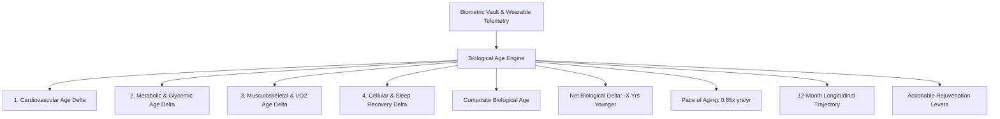

# Biological Age Estimation (Monthly, Deterministic)

## 1. Overview & Longevity Physiology
The **Biological Age Estimation Engine** (`BiologicalAgeScreen`) computes a deterministic, multi-system biomarker biological age and aging pace velocity ($\text{years}/\text{year}$) calibrated for the **South Asian phenotype**.

Traditional chronological age simply counts years since birth. Biological age estimates physiological wear-and-tear, cellular senescence, arterial elasticity, and mitochondrial reserve across 4 core subsystems:
1. **Cardiovascular System** (Resting Heart Rate, Blood Pressure, rMSSD HRV, Mean Arterial Pressure)
2. **Metabolic & Glycemic System** (Waist-to-Height Ratio, Fasting Glucose, Estimated HbA1c, Visceral Adipose Index)
3. **Cardiorespiratory & Musculoskeletal** (VO2 Max, Daily Step Volume, Progressive Strength Training Tonnage)
4. **Cellular Recovery & Neuro-Circadian** (Deep Sleep Architecture, Sleep Debt Clearance, Anti-Inflammatory Nutrition Index)

---

## 2. Multi-System Architecture

### Aging Pace Velocity:
| Status | Velocity Range | Clinical Significance |
| :--- | :--- | :--- |
| **Decelerated (Rejuvenating)** | $< 0.92\times$ | Physiological systems aging slower than chronological calendar time |
| **Normal Equilibrium** | $0.92 - 1.06\times$ | Balanced biological wear rate |
| **Accelerated Aging** | $> 1.06\times$ | Elevated lifestyle strain accelerating cellular senescence |

---

## 3. Mathematical Formulations

### Composite Biological Age:
$$\text{Age}_{\text{Bio}} = \text{Age}_{\text{Chrono}} + (0.30 \cdot \Delta_{\text{Cardio}}) + (0.30 \cdot \Delta_{\text{Metabolic}}) + (0.25 \cdot \Delta_{\text{Musculo}}) + (0.15 \cdot \Delta_{\text{Recovery}})$$

Where:
- $\Delta_{\text{Cardio}} = \delta_{\text{RHR}} + \delta_{\text{HRV}} + \delta_{\text{BP}}$
- $\Delta_{\text{Metabolic}} = \delta_{\text{WHtR}} + \delta_{\text{Glycemic}}$ (with South Asian central adiposity threshold $\text{WHtR} \le 0.46$)
- $\Delta_{\text{Musculo}} = \delta_{\text{VO2Max}} + \delta_{\text{Movement\&Strength}}$
- $\Delta_{\text{Recovery}} = \delta_{\text{DeepSleep}} + \delta_{\text{AntiInflammatoryDiet}}$

### Aging Pace Velocity:
$$\text{Pace}_{\text{Aging}} = \text{clamp}\left(1.0 + \frac{\text{Age}_{\text{Bio}} - \text{Age}_{\text{Chrono}}}{0.65 \cdot \text{Age}_{\text{Chrono}}}, 0.65, 1.45\right)$$

---

## 4. Source Files Reference
- **Domain Models**: [`lib/features/predictive_health/domain/bio_age_models.dart`](file:///f:/fitkarma/lib/features/predictive_health/domain/bio_age_models.dart)
- **Deterministic Engine**: [`lib/features/predictive_health/domain/bio_age_engine.dart`](file:///f:/fitkarma/lib/features/predictive_health/domain/bio_age_engine.dart)
- **State Provider**: [`lib/features/predictive_health/presentation/providers/bio_age_provider.dart`](file:///f:/fitkarma/lib/features/predictive_health/presentation/providers/bio_age_provider.dart)
- **UI Screen**: [`lib/features/predictive_health/presentation/bio_age_screen.dart`](file:///f:/fitkarma/lib/features/predictive_health/presentation/bio_age_screen.dart)
- **Unit & Offline Tests**: [`test/features/predictive_health/bio_age_test.dart`](file:///f:/fitkarma/test/features/predictive_health/bio_age_test.dart)

---

## 5. Offline Verification & Security
- **100% Deterministic & Offline**: All multi-variate regressions, pace derivations, organ system scores, and trajectory interpolations execute on-device in pure Dart with zero cloud network requirements.
- **Firestore Security Rules**: User biological age snapshots are stored under `/users/{userId}/biologicalAge/{snapshotId}` and protected with strict owner-only read/write access.
