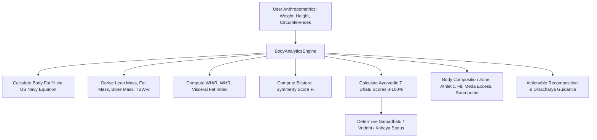

# Visual Body Analytics & Composition Screen

## 1. Overview & Anthropometric Architecture
The **Body Analytics Screen** (`BodyAnalyticsScreen`) delivers comprehensive body composition, anthropometric circumference tracking, bilateral limb symmetry assessment, and Ayurvedic **7 Dhatu (सप्त धातु)** tissue health analysis.

Key Capabilities:
- **US Navy Anthropometric Body Fat Estimation**: Validated circumference-based calculations for males and females without requiring DEXA hardware.
- **Body Compartments**: Lean Muscle Mass (kg & %), Fat Mass (kg), Bone Mass (kg), Total Body Water (TBW %), and Visceral Fat Index (1–20).
- **Cardiometabolic Risk Stratification**: Waist-to-Height Ratio (WHtR target `< 0.50`) and Waist-to-Hip Ratio (WHR target `< 0.90` for males, `< 0.85` for females).
- **Bilateral Musculoskeletal Symmetry**: Precision tracking of left vs right biceps, thighs, and calves to identify imbalances.
- **Ayurvedic 7 Dhatu Tissue Quality Matrix**:
  1. *Rasa (रस)*: Lymphatic hydration & plasma equilibrium
  2. *Rakta (रक्त)*: Cardiovascular vitality & hemoglobin oxygenation
  3. *Mamsa (मांस)*: Muscle tone, density & structural integrity
  4. *Meda (मेद)*: Adipose lipid balance & metabolic fire (*Medagni*)
  5. *Asthi (अस्थि)*: Bone mineral structure & skeletal frame
  6. *Majja (मज्जा)*: Neuromuscular conduction & symmetry
  7. *Shukra / Ojas (शुक्र / ओजस)*: Deep cellular vitality reserve

---

## 2. Processing Flow

### Body Composition Zones:
| Zone | Sanskrit / Hindi | Characteristics |
| :--- | :--- | :--- |
| **Athletic Lean** | सुदृढ़ शारीरिक गठन | Low body fat, high muscle mass, optimal visceral fat |
| **Fit & Healthy** | संतुलित गठन (समधातु) | Balanced fat-to-muscle ratio, WHtR < 0.50 |
| **Elevated Adiposity** | मेद धातु आधिक्य | WHtR > 0.52, elevated visceral fat; benefit from calorie deficit & Shatapadi walk |
| **Sarcopenic Risk** | मांस धातु क्षय | Low lean mass relative to total weight; prioritizing resistance training & protein |

---

## 3. Source Files Reference
- **Domain Models**: [`lib/features/body_analytics/domain/body_analytics_models.dart`](file:///f:/fitkarma/lib/features/body_analytics/domain/body_analytics_models.dart)
- **Deterministic Engine**: [`lib/features/body_analytics/domain/body_analytics_engine.dart`](file:///f:/fitkarma/lib/features/body_analytics/domain/body_analytics_engine.dart)
- **State Provider**: [`lib/features/body_analytics/presentation/providers/body_analytics_provider.dart`](file:///f:/fitkarma/lib/features/body_analytics/presentation/providers/body_analytics_provider.dart)
- **UI Screen**: [`lib/features/body_analytics/presentation/body_analytics_screen.dart`](file:///f:/fitkarma/lib/features/body_analytics/presentation/body_analytics_screen.dart)
- **Unit & Offline Tests**: [`test/features/body_analytics/body_analytics_test.dart`](file:///f:/fitkarma/test/features/body_analytics/body_analytics_test.dart)

---

## 4. Offline Verification & Security
- **100% Deterministic & Pure Dart**: Anthropometric equations, BMR formulas, symmetry calculators, and Dhatu algorithms operate completely offline on-device.
- **Firestore Security Rules**: User body composition records are stored under `/users/{userId}/bodyAnalytics/{recordId}` with strict `isOwner(userId)` verification in [`firestore.rules`](file:///f:/fitkarma/firestore.rules).
