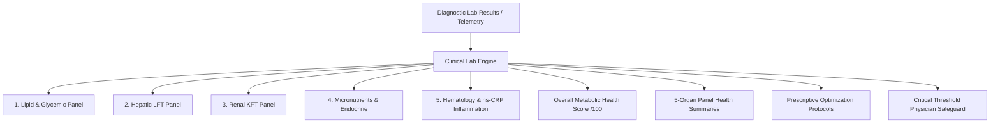

# Clinical Report Intelligence (Lab Data Parsing & Metabolic Analysis)

## 1. Overview & Clinical Value
The **Clinical Report Intelligence Engine** (`ClinicalReportScreen`) automates parsing, standardization, and physiological interpretation of standard diagnostic laboratory test reports (from Indian and international diagnostics providers like Dr. Lal PathLabs, SRL, Thyrocare, Metropolis, etc.).

It benchmarks extracted biomarkers against both conventional clinical reference ranges and South Asian **Longevity Optimal Ranges** across 5 core panels:
1. **Lipid & Glycemic Profile**: Fasting Glucose, HbA1c, Triglycerides, HDL-C, LDL-C, TG/HDL ratio.
2. **Hepatic Function (LFT)**: SGPT (ALT), SGOT (AST), AST/ALT ratio, GGT.
3. **Renal Function & Electrolytes (KFT)**: Serum Creatinine, Uric Acid, eGFR.
4. **Micronutrients & Endocrine**: Vitamin D3 (25-OH), Vitamin B12, TSH.
5. **Hematology & Inflammation**: Hemoglobin, high-sensitivity C-Reactive Protein (hs-CRP).

---

## 2. Parsing & Evaluation Architecture

### Biomarker Evaluation Categories:
| Status | Hindi / Sanskrit | Clinical Meaning | Action Trigger |
| :--- | :--- | :--- | :--- |
| **Optimal** | उत्कृष्ट (*Surakshit*) | Within South Asian longevity range | Maintain routine |
| **Borderline** | सीमांत (*Satark*) | Within standard lab range but sub-optimal | Lifestyle adjustment |
| **Abnormal** | असंतुलित | Outside standard reference range | Structured protocol |
| **Critical Alert** | चिंताजनक (*Chintajanak*) | Severe pathological breach | Physician escalation |

---

## 3. Source Files Reference
- **Domain Models**: [`lib/features/predictive_health/domain/clinical_lab_models.dart`](file:///f:/fitkarma/lib/features/predictive_health/domain/clinical_lab_models.dart)
- **Deterministic Engine**: [`lib/features/predictive_health/domain/clinical_lab_engine.dart`](file:///f:/fitkarma/lib/features/predictive_health/domain/clinical_lab_engine.dart)
- **State Provider**: [`lib/features/predictive_health/presentation/providers/clinical_lab_provider.dart`](file:///f:/fitkarma/lib/features/predictive_health/presentation/providers/clinical_lab_provider.dart)
- **UI Screen**: [`lib/features/predictive_health/presentation/clinical_lab_screen.dart`](file:///f:/fitkarma/lib/features/predictive_health/presentation/clinical_lab_screen.dart)
- **Unit & Offline Tests**: [`test/features/predictive_health/clinical_lab_test.dart`](file:///f:/fitkarma/test/features/predictive_health/clinical_lab_test.dart)

---

## 4. Offline Verification & Security
- **100% Deterministic & Offline**: Standardizes, grades, and prescribes lifestyle interventions for all parsed lab values on-device with zero network latency.
- **Firestore Security Rules**: User clinical lab reports are stored under isolated subcollection `/users/{userId}/labReports/{reportId}` protected with strict owner-only access.
