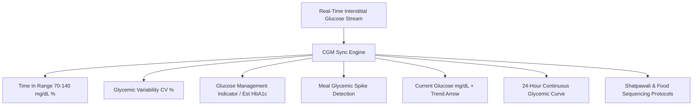

# Continuous Biomarker (CGM) Sync & Glycemic Dynamics

## 1. Overview & Metabolic Longevity Rationale
The **Continuous Biomarker (CGM) Sync Engine** (`ContinuousBiomarkerScreen`) integrates interstitial Continuous Glucose Monitoring feeds (e.g. FreeStyle Libre, Dexcom, Ultrahuman M1, or simulated bluetooth feeds).

In the South Asian phenotype, postprandial glucose spikes ($\Delta > 30\text{ mg/dL}$) cause microvascular endothelial oxidative stress and advance glycated end-products (AGEs) even when fasting glucose appears normal. The engine tracks:
1. **Time in Range (TIR)**: Longevity target $> 85\%$ in the $70 - 140\text{ mg/dL}$ window.
2. **Glycemic Variability (CV%)**: Coefficient of variation target $< 20\%$ to prevent glycemic instability.
3. **Estimated GMI (HbA1c Equivalent)**: Continuous 24-hour mean projection.
4. **Postprandial Excursion & Shatpawali Correlation**: Immediate blunting effect of post-meal 100-step walks.

---

## 2. Telemetry & Analytics Architecture

### Clinical Glycemic Ranges:
| Range Tier | Value Window | Target % | Clinical Significance |
| :--- | :--- | :--- | :--- |
| **Low / Hypoglycemic** | $< 70\text{ mg/dL}$ | $< 1\%$ | Hypoglycemia risk |
| **Optimal In-Range** | $70 - 140\text{ mg/dL}$ | $\ge 85\%$ | Optimal endothelial longevity |
| **Elevated** | $141 - 180\text{ mg/dL}$ | $< 10\%$ | Moderate postprandial excursion |
| **Acute Spike** | $> 180\text{ mg/dL}$ | $0\%$ | Significant endothelial oxidative strain |

---

## 3. Mathematical Formulations

### Glucose Management Indicator (GMI / est. HbA1c %):
$$\text{GMI} = 3.31 + (0.02392 \cdot \text{MeanGlucose}_{24\text{h}})$$

### Glycemic Variability (Coefficient of Variation CV %):
$$\text{CV} = \frac{\text{SD}_{\text{Glucose}}}{\text{MeanGlucose}_{24\text{h}}} \times 100\%$$

---

## 4. Source Files Reference
- **Domain Models**: [`lib/features/predictive_health/domain/cgm_sync_models.dart`](file:///f:/fitkarma/lib/features/predictive_health/domain/cgm_sync_models.dart)
- **Deterministic Engine**: [`lib/features/predictive_health/domain/cgm_sync_engine.dart`](file:///f:/fitkarma/lib/features/predictive_health/domain/cgm_sync_engine.dart)
- **State Provider**: [`lib/features/predictive_health/presentation/providers/cgm_sync_provider.dart`](file:///f:/fitkarma/lib/features/predictive_health/presentation/providers/cgm_sync_provider.dart)
- **UI Screen**: [`lib/features/predictive_health/presentation/cgm_sync_screen.dart`](file:///f:/fitkarma/lib/features/predictive_health/presentation/cgm_sync_screen.dart)
- **Unit & Offline Tests**: [`test/features/predictive_health/cgm_sync_test.dart`](file:///f:/fitkarma/test/features/predictive_health/cgm_sync_test.dart)

---

## 5. Offline Verification & Security
- **100% Deterministic & Offline**: All statistical aggregations, TIR percentages, GMI estimates, and spike detections execute on-device in pure Dart with zero cloud network requirements.
- **Firestore Security Rules**: User continuous glucose logs are stored under `/users/{userId}/cgmReadings/{readingId}` protected with strict owner-only access.
