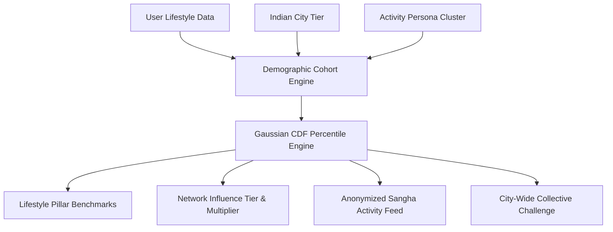

# Demographic Cohort Insights & Network Effects (Sangha Power)

## 1. Overview & Cultural Philosophy
The **Demographic Cohort Insights & Network Effects** engine contextualizes an athlete's physical progress against verified demographic cohorts across Indian city tiers and lifestyle personas. Grounded in behavioral science and the ancient Indian concept of **Sangha (सत्संग / सामूहिक साधना)**, it models **positive social contagion** — demonstrating how an individual's habit consistency uplifts their entire peer group and unlocks network-wide Karma multipliers.

---

## 2. Demographic Architecture & Clusters

### Supported Dimensions:
- **Indian City Tiers**:
  - `tier1`: Metros (Mumbai, NCR, Bengaluru, Hyderabad) — High density, sedentary commute correction.
  - `tier2`: Emerging Metros (Pune, Ahmedabad, Jaipur, Chandigarh) — Moderate density.
  - `tier3`: Pan-India Towns — High natural baseline movement.
- **Activity Persona Clusters**:
  - `techSedentary`: Desk-bound knowledge workers (6,000 steps baseline).
  - `activeExecutive`: High-velocity corporate athletes (8,500 steps baseline).
  - `studentAthlete`: Competitive youth (11,000 steps baseline).
  - `activeHomemaker`: Multi-tasking household athletes (9,500 steps baseline).

---

## 3. Mathematical Foundations

### Normal CDF Approximation
Percentiles are derived deterministically offline using the logistic approximation of the Standard Normal Cumulative Distribution Function:

$$\Phi(Z) = \frac{1}{1 + e^{-1.702 \cdot Z}}$$

Where:
$$Z = \frac{X - \mu}{\sigma}$$

### Social Contagion Index ($C_s$)
The statistical momentum an athlete transmits to their cohort:

$$C_s = (A \cdot 0.40) + \left(\min\left(\frac{S}{30}, 1.0\right) \cdot 30.0\right) + (P_c \cdot 0.30)$$

Where:
- $A$: 30-Day Adherence Score ($0 - 100$)
- $S$: Current Active Streak Days ($0 - 30+$)
- $P_c$: Composite Lifestyle Percentile ($0 - 100$)

### Network Influence Tiers:
| Tier | Hindi / Sanskrit | Multiplier | Minimum Criteria |
| :--- | :--- | :--- | :--- |
| **Seed** | आरंभिक साधक (*Arambha*) | 1.00x | Baseline entry |
| **Catalyst** | आदत प्रेरक (*Prerak*) | 1.15x | $P_c \ge 55\%$, Streak $\ge 7\text{d}$, $A \ge 60$ |
| **Vanguard** | अग्रणी साधक (*Agrani*) | 1.25x | $P_c \ge 75\%$, Streak $\ge 14\text{d}$, $A \ge 75$ |
| **Luminary** | संघ मार्गदर्शक (*Margdarshak*) | 1.40x | $P_c \ge 90\%$, Streak $\ge 21\text{d}$, $A \ge 85$ |

---

## 4. Source File Reference
- **Domain Models**: [`lib/features/gamification/domain/cohort_models.dart`](file:///f:/fitkarma/lib/features/gamification/domain/cohort_models.dart)
- **Deterministic Engine**: [`lib/features/gamification/domain/cohort_insights_engine.dart`](file:///f:/fitkarma/lib/features/gamification/domain/cohort_insights_engine.dart)
- **State Provider**: [`lib/features/gamification/presentation/providers/cohort_provider.dart`](file:///f:/fitkarma/lib/features/gamification/presentation/providers/cohort_provider.dart)
- **UI Screen**: [`lib/features/gamification/presentation/cohort_insights_screen.dart`](file:///f:/fitkarma/lib/features/gamification/presentation/cohort_insights_screen.dart)

---

## 5. Offline Verification & Security
- **100% Offline-First**: All cluster statistical baselines and CDF calculations execute locally in pure Dart.
- **Security & Anonymity**: Cohort stream data utilizes aggregate tier metrics with zero identifiable personal information; protected under Firestore rules `/cohortBenchmarks/{cohortKey}` (read-only for clients).
