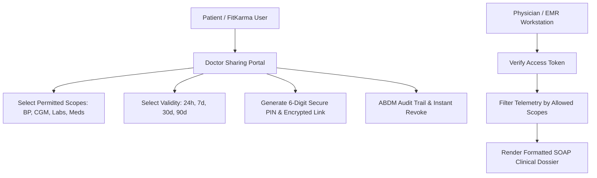

# Doctor Sharing Portal (ABDM / EMR Interoperability)

## 1. Overview & Healthcare Privacy Architecture
The **Doctor Sharing Portal** (`DoctorSharingScreen`) enables patients to securely share time-bound, permission-gated clinical telemetry with primary care physicians, cardiologists, endocrinologists, and Ayurvedic doctors.

Compliant with the **Ayushman Bharat Digital Mission (ABDM)** and global HIPAA frameworks, all doctor access is:
- **Scope-Restricted**: Patients explicitly select which data categories to share (Cardiovascular, Glycemic/CGM, Lab Biomarkers, Medication Regimens, Sleep/Recovery).
- **Time-Bounded**: Temporary access tokens (24h, 7d, 30d, 90d) automatically expire.
- **Instantly Revocable**: 1-tap "Revoke All Access" invalidates all tokens immediately.
- **Audit-Logged**: Every doctor access event records timestamp, scopes viewed, and IP/Device signatures.

---

## 2. Portal & Consent Architecture

### Permitted Data Scopes:
| Scope | Sanskrit / Hindi | Description |
| :--- | :--- | :--- |
| **Cardiovascular & BP** | हृदय गति व रक्तचाप | 30-day RHR, SBP/DBP hemodynamics, and autonomic HRV |
| **Glycemic & CGM** | शर्करा व निरंतर CGM | Time in Range (TIR 70-140 mg/dL), mean glucose, postprandial spikes |
| **Diagnostic Labs** | प्रयोगशाला परीक्षण रिपोर्ट | Lipid panels, HbA1c, LFT liver enzymes, KFT renal markers |
| **Medication Regimens** | दवाओं की सूची व अनुपालन | Allopathic prescriptions, Ayurvedic rasayanas, adherence % |
| **Sleep & Recovery** | नींद संरचना व पुनर्जनन | Deep delta sleep %, sleep debt, and stress dynamics |

---

## 3. Source Files Reference
- **Domain Models**: [`lib/features/predictive_health/domain/doctor_sharing_models.dart`](file:///f:/fitkarma/lib/features/predictive_health/domain/doctor_sharing_models.dart)
- **Deterministic Engine**: [`lib/features/predictive_health/domain/doctor_sharing_engine.dart`](file:///f:/fitkarma/lib/features/predictive_health/domain/doctor_sharing_engine.dart)
- **State Provider**: [`lib/features/predictive_health/presentation/providers/doctor_sharing_provider.dart`](file:///f:/fitkarma/lib/features/predictive_health/presentation/providers/doctor_sharing_provider.dart)
- **UI Screen**: [`lib/features/predictive_health/presentation/doctor_sharing_screen.dart`](file:///f:/fitkarma/lib/features/predictive_health/presentation/doctor_sharing_screen.dart)
- **Unit & Offline Tests**: [`test/features/predictive_health/doctor_sharing_test.dart`](file:///f:/fitkarma/test/features/predictive_health/doctor_sharing_test.dart)

---

## 4. Offline Verification & Security
- **100% Deterministic & Offline**: All grant generators, SOAP dossier formatting, and access scope filtering run locally in pure Dart.
- **Firestore Security Rules**: Sharing tokens are stored under `/users/{userId}/doctorGrants/{grantId}` with strict patient ownership and time-bounded validity checks.
