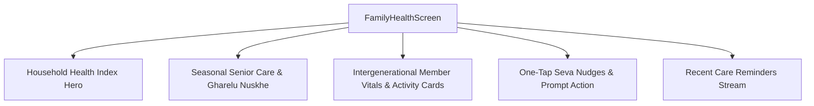

# Family Health Hub (Parivar Swasthya Kendra & Intergenerational Care)

## 1. Overview & Cultural Philosophy
The **Family Health Hub** (`FamilyHealthScreen`) bridges the digital health gap for South Asian households, where health is fundamentally collective and intergenerational. Designed for caregivers managing aging parents' wellness alongside their own, the hub enables:
- **Remote Vitals Tracking**: Blood Pressure (SBP/DBP), Fasting Glucose/estimated HbA1c, and Resting Heart Rate for seniors.
- **Elder Shatpawali & Movement Tracking**: Realistic senior movement baselines (5,000 to 6,000 steps) and post-meal stroll monitoring.
- **One-Tap Seva Nudges**: High-empathy, gentle WhatsApp/SMS reminders (*"Pitaji, let's take a 10-minute stroll after dinner!"*).
- **Household Health Index ($H_{\text{family}}$)**: Composite household wellness score evaluating collective vitals stability and movement.
- **Seasonal Kitchen Medicine (*Gharelu Nuskhe*)**: Curated, physician-reviewed Ayurvedic home remedies for elder joint and digestive comfort.

---

## 2. Visual Layout & Component Architecture

### Key UI Sections:
- **Household Health Index Hero**: Displays the composite family wellness percentage with a [`GlowingMetric`](file:///f:/fitkarma/lib/shared/widgets/glowing_metric.dart) and total family steps tally.
- **Seasonal Senior Care Card**: Actionable recipes with carminative ingredients (Ajwain, Saunf, Kala Namak, Haldi).
- **Member Vitals Cards**:
  - Relation badges (*Pitaji*, *Mataji*, *Jeevansathi*).
  - Blood pressure pill with risk-colored state (Optimal $<135/85$, Attention, Clinical Alert $\ge 140/90$).
  - Step progress bar and Shatpawali completion status.
  - Interactive "Prompt Shatpawali Walk" button triggering instant Seva nudges.

---

## 3. Mathematical Foundations

### Household Health Score ($H_{\text{family}} \in [0, 100]$)
$$H_{\text{family}} = (0.35 \cdot \bar{S}_{\text{family}}) + (0.30 \cdot \bar{W}_{\text{shatpawali}}) + (0.35 \cdot \bar{V}_{\text{stability}})$$

Where:
- $\bar{S}_{\text{family}}$: Average family step target attainment ($0 - 100\%$).
- $\bar{W}_{\text{shatpawali}}$: Family post-meal Shatpawali completion rate ($0 - 100\%$).
- $\bar{V}_{\text{stability}}$: Senior blood pressure and glucose stability index ($0 - 100\%$).

### Risk Classification Protocol:
$$\text{Status} = \begin{cases} 
\text{Alert} & \text{if } \text{SBP} \ge 140 \lor \text{DBP} \ge 90 \lor \text{Glucose} \ge 130\text{ mg/dL} \\ 
\text{Attention} & \text{if } \neg\text{Shatpawali} \land \text{Steps} < 0.60 \times \text{Target} \\
\text{Optimal} & \text{otherwise}
\end{cases}$$

---

## 4. Source Files Reference
- **Domain Models**: [`lib/features/social/domain/family_models.dart`](file:///f:/fitkarma/lib/features/social/domain/family_models.dart)
- **Deterministic Engine**: [`lib/features/social/domain/family_engine.dart`](file:///f:/fitkarma/lib/features/social/domain/family_engine.dart)
- **State Provider**: [`lib/features/social/presentation/providers/family_provider.dart`](file:///f:/fitkarma/lib/features/social/presentation/providers/family_provider.dart)
- **UI Screen**: [`lib/features/social/presentation/family_health_screen.dart`](file:///f:/fitkarma/lib/features/social/presentation/family_health_screen.dart)

---

## 5. Offline Verification & Security Rules
- **100% Offline Resilience**: Computes household scores, vitals risk classifications, and Seva reminders locally from Hive cached states.
- **Firestore Security Rules**: Protected under user subcollection `/users/{userId}/familyMembers/{memberId}` with strictly isolated user ownership checks.
