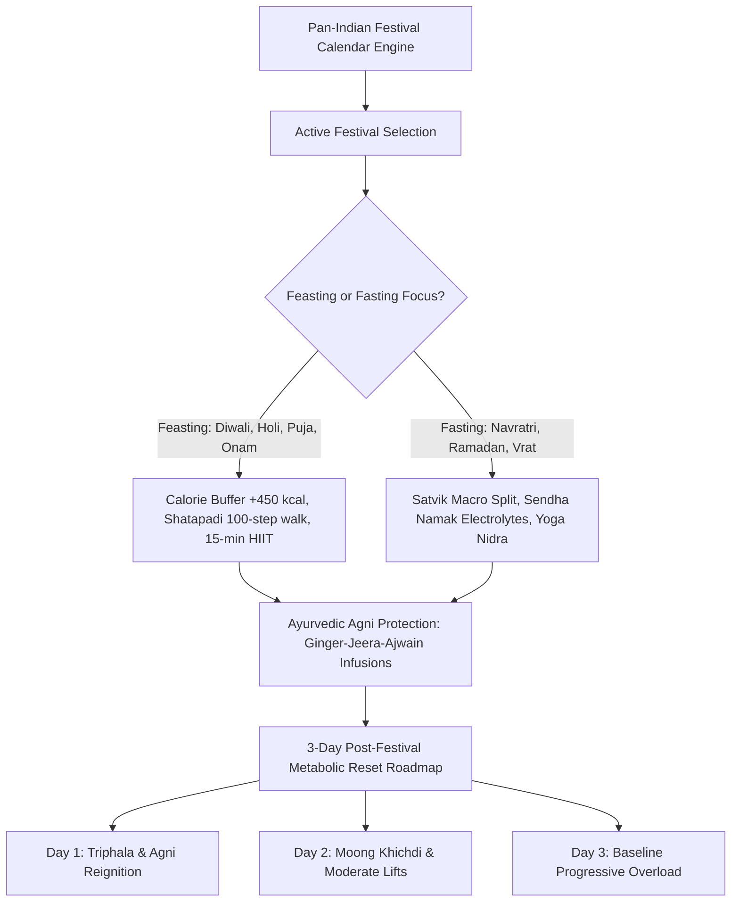

# Festival Intelligence System

## 1. Overview & Cultural Wellness Philosophy
The **Festival Intelligence System** (`FestivalIntelligenceScreen`) dynamically adapts user wellness protocols across the Pan-Indian festive calendar (Diwali, Holi, Navratri, Ramadan & Eid, Durga Puja, Ganesh Chaturthi, Makar Sankranti/Pongal/Lohri, Onam, Karwa Chauth/Ekadashi).

Rather than enforcing guilt-inducing restrictions, FitKarma's philosophy balances cultural cherishing with scientific physiological resilience:
- **Multi-Pillar Dynamic Recalibration**: Automatically recalibrates workouts (15-min metabolic micro-circuits), nutrition buffers (+350 to +450 kcal), circadian sleep debt recovery (Yoga Nidra), and Ayurvedic digestive fire (*Deepana-Pachana* ginger infusions).
- **Satvik Vrat & Intermittent Fasting Protocols**: Specialized bioenergetic support for fasting periods (Navratri, Ramadan, Ekadashi), emphasizing electrolyte hydration (*Sendha Namak*, tender coconut water), complex buckwheat/samak grains, and muscle retention.
- **3-Day Post-Festival Metabolic Reset**: A structured 3-day roadmap (Agni reignition & Triphala, cellular autophagy with green moong khichdi, baseline progressive overload re-entry).
- **Non-Guilt AI Coach Persona**: Reconfigures Groq LLM coach personality to celebrate cultural harmony and eliminate compensatory food anxiety.

---

## 2. Festival Framework & Processing Architecture

### Supported Pan-Indian Festivals:
| Festival | Season | Primary Focus | Calorie Delta |
| :--- | :--- | :--- | :--- |
| **Diwali (Deepavali)** | Autumn / Kartik | Feasting, Mithai & Family | +450 kcal |
| **Holi** | Spring / Phalguna | Active Play, Thandai & Gujiya | +400 kcal |
| **Navratri** | Spring / Autumn | 9-Day Satvik Vrat & Garba Steps | -200 kcal |
| **Ramadan & Eid** | Lunar Hijri | Suhoor & Iftar Intermittent Fasting | -100 kcal |
| **Durga Puja** | Autumn / Ashwin | Pandal Hopping & Festive Bhog | +350 kcal |
| **Ganesh Chaturthi** | Bhadrapada | Modak Moderation & Processions | +300 kcal |
| **Makar Sankranti / Pongal** | Winter / Pausha | Sesame, Jaggery & Harvest Feast | +350 kcal |
| **Onam** | Chingam / Autumn | Grand Onasadya Feasting | +400 kcal |
| **Karwa Chauth / Ekadashi** | Lunar Days | Phalahari / Nirjala Fasting | -500 kcal |

---

## 3. Source Files Reference
- **Domain Models**: [`lib/features/festival_life_events/domain/festival_intelligence_models.dart`](file:///f:/fitkarma/lib/features/festival_life_events/domain/festival_intelligence_models.dart)
- **Deterministic Engine**: [`lib/features/festival_life_events/domain/festival_intelligence_engine.dart`](file:///f:/fitkarma/lib/features/festival_life_events/domain/festival_intelligence_engine.dart)
- **State Provider**: [`lib/features/festival_life_events/presentation/providers/festival_intelligence_provider.dart`](file:///f:/fitkarma/lib/features/festival_life_events/presentation/providers/festival_intelligence_provider.dart)
- **UI Screen**: [`lib/features/festival_life_events/presentation/festival_intelligence_screen.dart`](file:///f:/fitkarma/lib/features/festival_life_events/presentation/festival_intelligence_screen.dart)
- **Unit & Offline Tests**: [`test/features/festival_life_events/festival_intelligence_test.dart`](file:///f:/fitkarma/test/features/festival_life_events/festival_intelligence_test.dart)

---

## 4. Offline Verification & Security
- **100% Deterministic & Pure Dart**: Calendar algorithms, multi-pillar strategy generators, and 3-day reset roadmaps execute completely offline on-device.
- **Firestore Security Rules**: User festival preferences and active mode states are stored under `/users/{userId}/festivalPreferences/{prefId}` with strict `isOwner(userId)` verification in [`firestore.rules`](file:///f:/fitkarma/firestore.rules).
