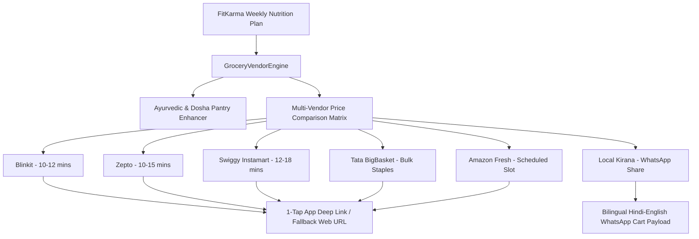

# Grocery Vendor Checkout Integration (10-Min Quick-Commerce & Kirana) 🇮🇳

## 1. Overview
The **Grocery Vendor Checkout Integration** connects FitKarma's budget-optimized Indian nutrition planner directly to India's leading Quick-Commerce platforms (**Blinkit, Zepto, Swiggy Instamart**), e-grocery giants (**Tata BigBasket, Amazon Fresh**), and local neighborhood **Kirana stores**.

Users can convert their personalized weekly protein and macronutrient grocery plans into live vendor price quotes, compare turnaround speeds and delivery fees side-by-side, and execute 1-tap deep links or export bilingual WhatsApp shopping lists formatted for local grocers.

---

## 2. Architecture & Supported Vendors

### Supported Vendors:
| Vendor | Target Niche | ETA | Deep Link Scheme |
| :--- | :--- | :--- | :--- |
| **Blinkit** | Ultra-fast fresh produce & essentials | 10-12 mins | `blinkit://search?q=...` |
| **Zepto** | 10-min quick-commerce | 10-15 mins | `zepto://search?query=...` |
| **Swiggy Instamart** | Quick delivery with Instamart promos | 12-18 mins | `swiggy://instamart/search?query=...` |
| **Tata BigBasket** | Bulk pantry staples (Atta, Dals, Millets) | 2 hrs / Same Day | `bigbasket://search?q=...` |
| **Amazon Fresh** | Bulk grocery & Prime discounts | Next Morning Slot | `https://www.amazon.in/s?k=...` |
| **Local Kirana** | Traditional neighborhood grocer | Instant / Free delivery | `https://wa.me/?text=...` |

---

## 3. Key Components

1. **Domain Models** ([`grocery_vendor_models.dart`](file:///f:/fitkarma/lib/features/nutrition/domain/grocery_vendor_models.dart)):
   - `GroceryVendorType`: Enum representing vendors with metadata (display name, Hindi name, brand colors, deep-link prefixes).
   - `VendorCartItem`: Item models with regional names (e.g., *सोया बड़ी*, *सत्तू*, *खपली आटा*), Ayurvedic classification, protein yield, and cost-per-gram protein calculation.
   - `VendorPriceQuote`: Full breakdown including subtotal, platform handling fee, delivery fee, promotional discounts, ETA, and cheapest/fastest tags.
   - `GroceryVendorCheckoutPayload`: Complete actionable payload with Pincode, protein totals, and WhatsApp shareable strings.

2. **Calculation Engine** ([`grocery_vendor_engine.dart`](file:///f:/fitkarma/lib/features/nutrition/domain/grocery_vendor_engine.dart)):
   - Pure Dart deterministic compilation of multi-vendor pricing algorithms.
   - Ayurvedic superfood injector (A2 Desi Cow Ghee, Sendha Namak, Lakadong Turmeric, Foxtail Millets).
   - Automated bilingual WhatsApp formatter for instant family or shopkeeper dispatch.

3. **Riverpod State Management** ([`grocery_vendor_provider.dart`](file:///f:/fitkarma/lib/features/nutrition/providers/grocery_vendor_provider.dart)):
   - `GroceryVendorNotifier` managing active items, dietary filters, pincode changes, and vendor selection.

4. **Bento UI Screen** ([`grocery_vendor_checkout_screen.dart`](file:///f:/fitkarma/lib/features/nutrition/presentation/grocery_vendor_checkout_screen.dart)):
   - Live horizontal vendor price comparison carousel with "BEST PRICE" and "10 MINS" badges.
   - 1-Tap checkout bottom sheet with payload copying and direct deep-link triggers.
   - Interactive item checklist with Ayurvedic benefit annotations.

---

## 4. Verification & Testing

- **Unit Tests**: [`grocery_vendor_test.dart`](file:///f:/fitkarma/test/features/nutrition/grocery_vendor_test.dart)
  - Verified 100% vegetarian & non-vegetarian cart generation.
  - Verified all 6 vendor price quote calculations and deep link schemas.
  - Verified cheapest/fastest vendor identification.
  - Verified bilingual Hindi WhatsApp Kirana list formatting.
  - Verified protein calculation per Rupee efficiency metrics.
