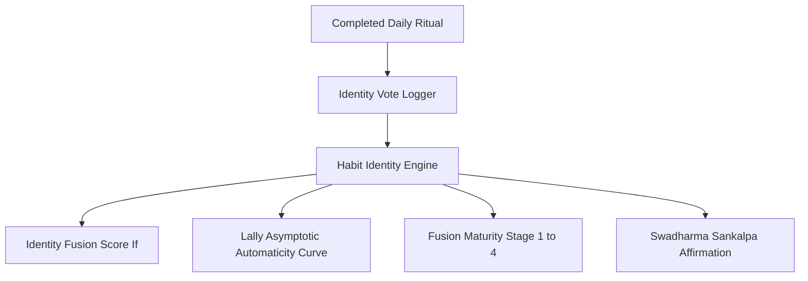

# Habit Identity Layer (Behavior Science & Swadharma)

## 1. Overview & Behavioral Science Foundations
The **Habit Identity Layer** bridges behavioral psychology (James Clear's Identity-Based Habits, BJ Fogg's Tiny Habits, and Phillippa Lally's Automaticity Curve) with the ancient Indian concept of **Swadharma (स्वधर्म / स्वरूप)**.

Instead of relying on fragile motivation or fleeting outcome-based goals, the system shifts an athlete's mental model to **Identity Fusion**:
- **Outcome Goal**: *"I want to walk 10,000 steps today."*
- **Identity Fusion**: *"I am a Dharma Yogi / Kshatriya Athlete who naturally moves and honors digestion."*

Every completed daily ritual casts an explicit **Identity Vote**, incrementally lowering cognitive friction and accelerating automaticity.

---

## 2. Architecture & Identity Archetypes

### Identity Archetypes (*Swaroopa*):
1. **Mindful Practitioner (*Dharma Yogi*)**: Circadian alignment, Surya Namaskar, Shatpawali, Sattvic recovery.
2. **Resilient Athlete (*Kshatriya Warrior*)**: Progressive overload, high protein density, VO2 Max conditioning.
3. **Urban Pacesetter (*Karmyogi*)**: High NEAT, 10k steps, executive stress regulation, micro-recovery.
4. **Preventive Healer (*Swasthya Rakshak*)**: Sub-0.50 WHtR, autonomic HRV recovery, blood pressure stability.

---

## 3. Mathematical Foundations

### Identity Fusion Score ($I_f \in [0, 100]$)
$$I_f = \min\left(40, 8.5 \cdot \ln(1 + V_t)\right) + \min\left(35, \frac{S_d}{30} \times 35\right) + (A \times 0.25)$$

Where:
- $V_t$: Total cumulative identity votes cast.
- $S_d$: Active habit streak (days).
- $A$: 30-Day Adherence Score ($0 - 100$).

### Lally Asymptotic Automaticity Curve ($A_u$)
Modeling cognitive automaticity growth over consecutive days of habit repetition ($d$):

$$A_u = 100 \times \left(1 - e^{-k \cdot d}\right) \quad (k = 0.038)$$

Cognitive Friction Reduction:
$$F_r = A_u \times 0.92$$

### Identity Maturity Stages:
| Stage | Level | Title | Min $I_f$ | Description |
| :--- | :--- | :--- | :--- | :--- |
| **Jigyasu** | 1 | Seeker (जिज्ञासु) | 0.0% | Willpower & prompt-reliant |
| **Abhyasi** | 2 | Practitioner (अभ्यासी) | 30.0% | Routine forming, friction dropping |
| **Nishtha** | 3 | Embodied (निष्ठावान) | 65.0% | Habit deeply internalized |
| **Sahaja** | 4 | Autonomous Master (सहज) | 85.0% | Complete identity fusion |

---

## 4. Source Files Reference
- **Domain Models**: [`lib/features/transformation/domain/habit_identity_models.dart`](file:///f:/fitkarma/lib/features/transformation/domain/habit_identity_models.dart)
- **Deterministic Engine**: [`lib/features/transformation/domain/habit_identity_engine.dart`](file:///f:/fitkarma/lib/features/transformation/domain/habit_identity_engine.dart)
- **State Provider**: [`lib/features/transformation/presentation/providers/habit_identity_provider.dart`](file:///f:/fitkarma/lib/features/transformation/presentation/providers/habit_identity_provider.dart)
- **UI Screen**: [`lib/features/transformation/presentation/habit_identity_screen.dart`](file:///f:/fitkarma/lib/features/transformation/presentation/habit_identity_screen.dart)

---

## 5. Offline Verification & Security
- **100% Offline Capability**: All logarithmic vote saturation formulas, automaticity curves, and stage determinations execute deterministically in pure Dart.
- **Data Security**: Stored under isolated user subcollections `/users/{userId}/identityVotes` and `/users/{userId}/habitIdentity` in Firestore.
