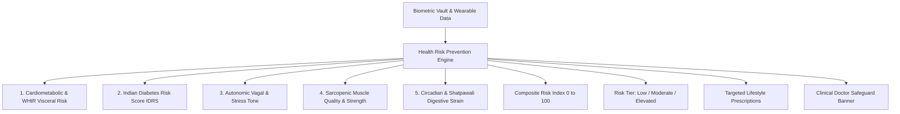

# Health Risk Prevention System (South Asian Clinical Stratification)

## 1. Overview & Clinical Rationale
The **Health Risk Prevention System** (`HealthRiskPreventionScreen`) provides multi-domain preventive clinical risk stratification tailored to the **South Asian cardiometabolic phenotype** ("Thin-Fat" body composition, high visceral adiposity at low BMI, early-onset insulin resistance, and autonomic dysregulation).

It synthesizes validated epidemiological models (such as the MDRF **Indian Diabetes Risk Score**, South Asian **Waist-to-Height Ratio** cutoffs, and autonomic resting heart rate markers) into actionable, non-pharmaceutical lifestyle protocols.

---

## 2. The 5 Clinical Domains

### Risk Stratification Tiers:
| Tier | Hindi / Sanskrit | Score Range | Meaning |
| :--- | :--- | :--- | :--- |
| **Low / Optimal** | सुरक्षित (*Surakshit*) | $0 - 24$ | Cardiometabolically resilient |
| **Moderate** | सतर्क (*Satark*) | $25 - 59$ | Early lifestyle intervention indicated |
| **Elevated** | चिंताजनक (*Chintajanak*) | $60 - 100$ | Active protocol adherence & physician checkup |

---

## 3. Mathematical & Clinical Formulations

### Indian Diabetes Risk Score (IDRS / MDRF Formulation):
$$\text{IDRS} = \text{Score}_{\text{Age}} + \text{Score}_{\text{Waist}} + \text{Score}_{\text{Activity}} + \text{Score}_{\text{FamilyHistory}}$$
- Age: $<35\text{y} = 0$, $35-49\text{y} = 20$, $\ge 50\text{y} = 30$.
- Waist (Male): $<85\text{cm} = 0$, $85-89\text{cm} = 10$, $\ge 90\text{cm} = 20$.
- Waist (Female): $<80\text{cm} = 0$, $80-89\text{cm} = 10$, $\ge 90\text{cm} = 20$.
- Physical Activity: $\ge 10\text{k steps} = 0$, $7-10\text{k} = 10$, $4-7\text{k} = 20$, $<4\text{k} = 30$.
- Family History: Both parents diabetic $= 20$, 1 parent $= 10$, None $= 0$.

### Composite Clinical Risk Score ($R_{\text{composite}}$):
$$R_{\text{composite}} = (0.30 \cdot R_{\text{CMR}}) + (0.25 \cdot R_{\text{IDRS}}) + (0.20 \cdot R_{\text{Autonomic}}) + (0.15 \cdot R_{\text{Sarcopenia}}) + (0.10 \cdot R_{\text{Circadian}})$$

### Doctor Escalation Trigger:
$$\text{Escalate} = (\text{SBP} \ge 140 \lor \text{DBP} \ge 90 \lor \text{Glucose} \ge 126\text{ mg/dL})$$

---

## 4. Source Files Reference
- **Domain Models**: [`lib/features/predictive_health/domain/health_risk_models.dart`](file:///f:/fitkarma/lib/features/predictive_health/domain/health_risk_models.dart)
- **Deterministic Engine**: [`lib/features/predictive_health/domain/health_risk_engine.dart`](file:///f:/fitkarma/lib/features/predictive_health/domain/health_risk_engine.dart)
- **State Provider**: [`lib/features/predictive_health/presentation/providers/health_risk_provider.dart`](file:///f:/fitkarma/lib/features/predictive_health/presentation/providers/health_risk_provider.dart)
- **UI Screen**: [`lib/features/predictive_health/presentation/health_risk_screen.dart`](file:///f:/fitkarma/lib/features/predictive_health/presentation/health_risk_screen.dart)

---

## 5. Offline Verification & Security Rules
- **100% Offline Resilience**: All MDRF IDRS points, WHtR evaluations, and protocol allocations execute deterministically on-device with zero cloud dependencies.
- **Firestore Security Rules**: User health risk profile state is stored under isolated subcollection `/users/{userId}/healthRiskProfiles/{profileId}` protected by user authentication.
