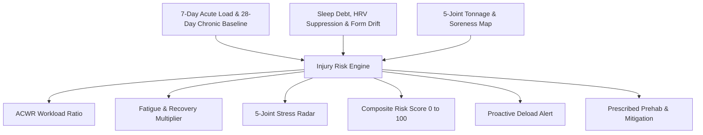

# Injury Risk Engine (ACWR & Musculoskeletal Biomechanics)

## 1. Overview & Sports Medicine Rationale
The **Injury Risk Engine** (`InjuryRiskScreen`) evaluates musculoskeletal injury probability by combining **Acute:Chronic Workload Ratio (ACWR)** dynamics with joint-specific mechanical fatigue, localized soreness ratings, and autonomic recovery suppression.

Sudden spikes in acute training load without adequate chronic physiological conditioning account for over 70% of soft-tissue sprains and tendinopathies. The engine continuously guards the user's workload progression to ensure training remains in the hypertrophic **Sweet Spot** while preventing dangerous overtraining spikes.

---

## 2. ACWR & Joint Assessment Architecture

### ACWR Workload Zones:
| Zone | Ratio Range | Clinical Interpretation | Action Required |
| :--- | :--- | :--- | :--- |
| **Under-training** | $< 0.85\times$ | Deconditioning / Sub-optimal adaptation | Gradual progressive overload |
| **Sweet Spot** | $0.85 - 1.25\times$ | Optimal progression & minimal injury risk | Maintain progressive trajectory |
| **Caution** | $1.25 - 1.45\times$ | Approaching tissue capacity | Prioritize sleep & prehab |
| **Danger Spike** | $> 1.45\times$ | High risk of tendon/muscle injury | Proactive volume deload (-30%) |

---

## 3. Mathematical Formulations

### Acute:Chronic Workload Ratio:
$$\text{ACWR} = \frac{\text{AcuteLoad}_{7\text{d}}}{\max(1.0, \text{ChronicLoad}_{28\text{d}})}$$

### Recovery Deficit Multiplier ($M_{\text{recovery}}$):
$$M_{\text{recovery}} = 1.0 + \Delta_{\text{SleepDebt}} + \Delta_{\text{HRVSuppression}} + \Delta_{\text{FormBreakdown}}$$

### Composite Injury Risk Score ($R_{\text{injury}}$):
$$R_{\text{injury}} = \text{clamp}\left((S_{\text{ACWR}} \cdot M_{\text{recovery}} \cdot 0.65) + (\max(S_{\text{Joint}}) \cdot 0.35), 0, 100\right)$$

---

## 4. Source Files Reference
- **Domain Models**: [`lib/features/predictive_health/domain/injury_risk_models.dart`](file:///f:/fitkarma/lib/features/predictive_health/domain/injury_risk_models.dart)
- **Deterministic Engine**: [`lib/features/predictive_health/domain/injury_risk_engine.dart`](file:///f:/fitkarma/lib/features/predictive_health/domain/injury_risk_engine.dart)
- **State Provider**: [`lib/features/predictive_health/presentation/providers/injury_risk_provider.dart`](file:///f:/fitkarma/lib/features/predictive_health/presentation/providers/injury_risk_provider.dart)
- **UI Screen**: [`lib/features/predictive_health/presentation/injury_risk_screen.dart`](file:///f:/fitkarma/lib/features/predictive_health/presentation/injury_risk_screen.dart)
- **Unit & Offline Tests**: [`test/features/predictive_health/injury_risk_test.dart`](file:///f:/fitkarma/test/features/predictive_health/injury_risk_test.dart)

---

## 5. Offline Verification & Security
- **100% Deterministic & Offline**: All ACWR ratios, exponential joint strain calculations, prehab assignments, and deload alerts run entirely on-device in pure Dart with zero cloud network reliance.
- **Firestore Security Rules**: User injury risk records are stored under `/users/{userId}/injuryRiskProfiles/{profileId}` protected with strict owner-only access.
