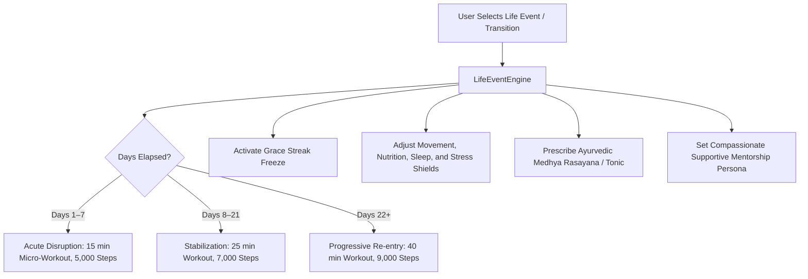

# Life Events Engine & Adaptive Resilience

## 1. Overview & Wellness Philosophy
The **Life Events Engine** (`LifeEventScreen`) dynamically buffers, recalibrates, and supports users through major lifestyle transitions and acute routine disruptions (Exam Seasons, Newborn Parenthood, Career Switches / Startup Crunches, City Relocation, Post-Illness Recovery, and Bereavement / Emotional Healing).

Rather than penalizing users with broken streaks or unrealistic demands during major life events, FitKarma's philosophy keeps identity and momentum alive through compassionate recalibration:
- **Grace Streak Freeze**: Protects user streaks and karma milestones while scaling daily anchors down to sustainable micro-habits.
- **3-Phase Timeline Progression**:
  1. *Acute Disruption (Days 1–7)*: Minimalist anchor (15-min micro-workout, 5,000 steps, survival nutrition).
  2. *Routine Stabilization (Days 8–21)*: Gradual expansion (25-min workouts, 7,000 steps).
  3. *Progressive Baseline Re-entry (Days 22+)*: Full reintegration into progressive overload (40-min workouts, 9,000 steps).
- **Ayurvedic Medhya Rasayanas & Nervine Tonics**: Targeted herbal adaptogens (*Brahmi/Shankhpushpi* for cognitive focus, *Shatavari/Dashamoola* for postpartum, *Ashwagandha* for career cortisol regulation, *Amritarishta* for post-viral convalescence).
- **Compassionate Mentorship**: Empathetic AI coaching that eliminates guilt and reinforces self-efficacy.

---

## 2. Event Adaptation Architecture

### Supported Life Event Categories:
| Life Event | Sanskrit / Hindi | Primary Adaptive Focus | Key Rasayana / Tonic |
| :--- | :--- | :--- | :--- |
| **Exam Crunch** | परीक्षा काल सत्र | Cognitive stamina & zero brain fog | Brahmi & Shankhpushpi |
| **New Parenthood** | नवजात शिशु देखभाल | Sleep preservation & posture recovery | Shatavari & Dashamoola |
| **Career Shift / Crunch** | नौकरी परिवर्तन / स्टार्टअप | Adrenal cortisol blunting & micro-HIIT | KSM-66 Ashwagandha |
| **Relocation** | शहर स्थानांतरण | Minimalist bodyweight & local sourcing | Tulsi-Ginger-Giloy |
| **Post-Illness Recovery** | रोगमुक्ति स्वास्थ्य लाभ | Agni restoration & Sukshma Vyayama | Amritarishta & Drakshasava |
| **Grief / Bereavement** | शोक निवारण संतुलन | Somatic nature grounding & calm | Arjuna Ksheerapaka & Jatamansi |

---

## 3. Source Files Reference
- **Domain Models**: [`lib/features/festival_life_events/domain/life_event_models.dart`](file:///f:/fitkarma/lib/features/festival_life_events/domain/life_event_models.dart)
- **Deterministic Engine**: [`lib/features/festival_life_events/domain/life_event_engine.dart`](file:///f:/fitkarma/lib/features/festival_life_events/domain/life_event_engine.dart)
- **State Provider**: [`lib/features/festival_life_events/presentation/providers/life_event_provider.dart`](file:///f:/fitkarma/lib/features/festival_life_events/presentation/providers/life_event_provider.dart)
- **UI Screen**: [`lib/features/festival_life_events/presentation/life_event_screen.dart`](file:///f:/fitkarma/lib/features/festival_life_events/presentation/life_event_screen.dart)
- **Unit & Offline Tests**: [`test/features/festival_life_events/life_event_test.dart`](file:///f:/fitkarma/test/features/festival_life_events/life_event_test.dart)

---

## 4. Offline Verification & Security
- **100% Deterministic & Pure Dart**: Transition timeline phase calculators, streak freeze handlers, and Ayurvedic recommendations execute entirely on-device without network dependence.
- **Firestore Security Rules**: User life event preferences and active transition logs are stored under `/users/{userId}/lifeEventStates/{eventId}` with strict `isOwner(userId)` verification in [`firestore.rules`](file:///f:/fitkarma/firestore.rules).
