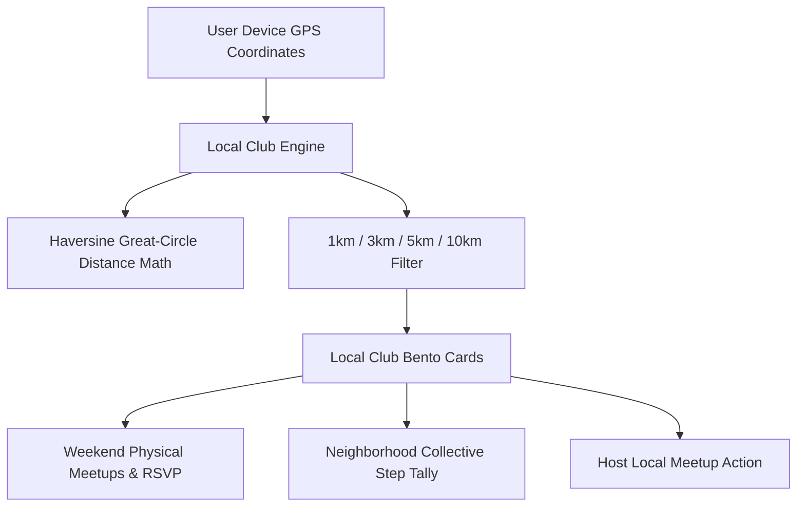

# Local Geolocation Clubs & Interest Circles (Kshetra Mandalas)

## 1. Overview & Cultural Philosophy
The **Local Geolocation Clubs** feature (`LocalGeolocationClubsScreen`) grounds digital habit tracking in physical local communities. Designed around **Kshetra (क्षेत्रीय समुदाय)**, it connects practitioners living within walking/commuting distance across Indian neighborhoods and municipal parks for weekend morning *Sadhana* meetups (Shatpawali, running, park yoga, and desi calisthenics).

---

## 2. Visual Architecture & Component Flow

### Key UI Sections:
- **Location & Radius Filter**:
  - Distance selection pills: `1 km`, `3 km`, `5 km`, `10 km`.
- **Club Bento Cards**:
  - Displays localized distance (`0.8 km away`), activity type badge, landmark area, active members count, and weekly collective steps ([`GlowingMetric`](file:///f:/fitkarma/lib/shared/widgets/glowing_metric.dart)).
- **Physical Meetup & RSVP Card**:
  - Offline physical meetup cards with venue landmark, date/time, organizer name, and instant RSVP toggle.
- **Host a Neighborhood Sadhana Banner**:
  - Action card allowing captains/pacesetters to organize weekend park meetups and earn +100 Organizer Karma.

---

## 3. Mathematical Foundations

### Haversine Great-Circle Distance Formula:
$$a = \sin^2\left(\frac{\Delta \phi}{2}\right) + \cos(\phi_1) \cdot \cos(\phi_2) \cdot \sin^2\left(\frac{\Delta \lambda}{2}\right)$$
$$d = 2 R \cdot \arctan2\left(\sqrt{a}, \sqrt{1 - a}\right) \quad (R = 6371\text{ km})$$

Where:
- $\phi_1, \phi_2$: Latitude coordinates in radians.
- $\Delta \lambda$: Longitude difference in radians.

---

## 4. Source Files Reference
- **Domain Models**: [`lib/features/social/domain/club_models.dart`](file:///f:/fitkarma/lib/features/social/domain/club_models.dart)
- **Deterministic Engine**: [`lib/features/social/domain/club_engine.dart`](file:///f:/fitkarma/lib/features/social/domain/club_engine.dart)
- **State Provider**: [`lib/features/social/presentation/providers/club_provider.dart`](file:///f:/fitkarma/lib/features/social/presentation/providers/club_provider.dart)
- **UI Screen**: [`lib/features/social/presentation/local_clubs_screen.dart`](file:///f:/fitkarma/lib/features/social/presentation/local_clubs_screen.dart)

---

## 5. Offline Verification & Security Rules
- **100% Offline Resilience**: All distance calculations and meetup RSVPs operate locally with pure Dart arithmetic.
- **Firestore Security Rules**: Protected under `/clubs/{clubId}` with open authenticated read/write access.
