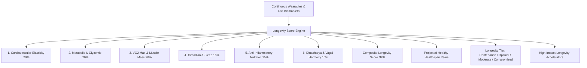

# Longevity Score (Multi-Pillar Healthspan Forecasting)

## 1. Overview & Longevity Physiology
The **Longevity Score Engine** (`LongevityScoreScreen`) computes a composite **Healthspan Resilience Score** ($0 - 100$) and projects disease-free healthy lifespan trajectory, calibrated specifically for the South Asian phenotype.

While biological age represents physiological wear-and-tear relative to calendar age, the Longevity Score synthesizes cross-system cellular resilience across 6 pillars:
1. **Cardiovascular & Arterial Elasticity** (20%): Pulse pressure compliance, resting heart rate efficiency, and autonomic vagal tone.
2. **Metabolic & Glycemic Reserve** (20%): Insulin sensitivity, glycemic variability, and visceral adipose suppression (WHtR $\le 0.46$).
3. **Cardiorespiratory & Sarcopenic Muscle Mass** (20%): VO2 Max reserve and progressive compound resistance volume.
4. **Cellular Recovery & Circadian Sleep Architecture** (15%): Slow-wave deep sleep percentage and sleep debt clearance.
5. **Nutritional & Anti-Inflammatory Index** (15%): Whole-food polyphenol density and protein pacing ($1.2 - 1.6\text{ g/kg}$).
6. **Ayurvedic & Mind-Body Homeostasis** (10%): Dinacharya regularity, Shatpawali adherence, and parasympathetic breathing pacing.

---

## 2. Multi-Pillar Architecture

### Longevity Tiers:
| Tier | Sanskrit / Hindi | Score Range | Healthspan Bonus | Clinical Trajectory |
| :--- | :--- | :--- | :--- | :--- |
| **Centenarian Potential** | शतायु दीर्घायु (*Shataayu*) | $90 - 100$ | $+8\text{ to }+12\text{ Yrs}$ | Centenarian decile longevity |
| **Optimal Healthspan** | आरोग्य (*Aarogya*) | $75 - 89$ | $+4\text{ to }+7\text{ Yrs}$ | Superior disease-free resilience |
| **Moderate Lifespan** | मध्यम (*Madhyam*) | $55 - 74$ | $0\text{ to }+3\text{ Yrs}$ | Average life expectancy trajectory |
| **Compromised Senescence** | सतर्क (*Satark*) | $0 - 54$ | $-4\text{ to }-8\text{ Yrs}$ | Reversible accelerated decay |

---

## 3. Mathematical Formulations

### Composite Longevity Score ($S_{\text{longevity}}$):
$$S_{\text{longevity}} = \sum_{i=1}^6 w_i \cdot S_i$$

### Projected Healthspan Age:
$$\text{Age}_{\text{Healthspan}} = \text{LifeExp}_{\text{Baseline}} + 0.75 \cdot (\text{Age}_{\text{Chrono}} - \text{Age}_{\text{Bio}}) + \frac{S_{\text{longevity}} - 50}{50} \cdot 8.5$$

---

## 4. Source Files Reference
- **Domain Models**: [`lib/features/predictive_health/domain/longevity_score_models.dart`](file:///f:/fitkarma/lib/features/predictive_health/domain/longevity_score_models.dart)
- **Deterministic Engine**: [`lib/features/predictive_health/domain/longevity_score_engine.dart`](file:///f:/fitkarma/lib/features/predictive_health/domain/longevity_score_engine.dart)
- **State Provider**: [`lib/features/predictive_health/presentation/providers/longevity_score_provider.dart`](file:///f:/fitkarma/lib/features/predictive_health/presentation/providers/longevity_score_provider.dart)
- **UI Screen**: [`lib/features/predictive_health/presentation/longevity_score_screen.dart`](file:///f:/fitkarma/lib/features/predictive_health/presentation/longevity_score_screen.dart)
- **Unit & Offline Tests**: [`test/features/predictive_health/longevity_score_test.dart`](file:///f:/fitkarma/test/features/predictive_health/longevity_score_test.dart)

---

## 5. Offline Verification & Security
- **100% Deterministic & Offline**: All 6 pillar aggregations, healthspan projections, and accelerator impact models execute locally in pure Dart.
- **Firestore Security Rules**: User longevity score records are stored under `/users/{userId}/longevityProfiles/{profileId}` protected with strict owner-only access.
