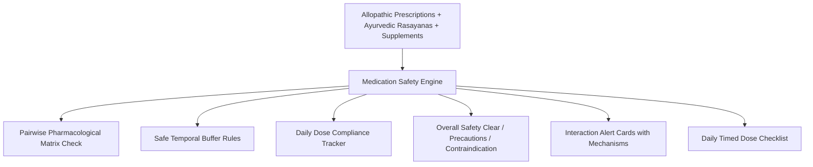

# Medication Tracker & Herb-Drug Interaction Warning Engine

## 1. Overview & Clinical Rationale
The **Medication Tracker & Herb-Drug Interaction Engine** (`MedicationSafetyScreen`) provides comprehensive polypharmacy tracking with special cross-screening for **Ayurvedic Herb-Drug Interactions**.

In Indian households, the co-administration of modern allopathic drugs (e.g. Metformin, Telmisartan, Ecosprin, Thyronorm) alongside traditional Ayurvedic formulations (e.g. Ashwagandha, Curcumin, Karela, Triphala) is widespread. Unmonitored polypharmacy can lead to:
- Additive hypoglycemia (*Karela/Methi + Metformin*).
- Platelet inhibition and bleeding risks (*High-dose Curcumin + Aspirin*).
- Reduced bioavailability through chelation (*Calcium/Iron + Levothyroxine*).
- Tannin binding and delayed absorption (*Triphala + Allopathic pills*).

The engine flags pairwise contraindications and enforces safe temporal buffers (e.g., separating doses by 2–4 hours).

---

## 2. Interaction Screening Architecture

### Interaction Severity Tiers:
| Severity | Sanskrit / Hindi | Color | Action Required |
| :--- | :--- | :--- | :--- |
| **Critical** | गंभीर (*Gambhir*) | Red | Immediate physician consultation / Stop co-intake |
| **Moderate** | सतर्क (*Satark*) | Orange | Safe temporal spacing (2–4 hours) & vitals monitoring |
| **Minor** | सचेत (*Sachet*) | Blue | Nutritional timing adjustment (e.g. with meals) |

---

## 3. Source Files Reference
- **Domain Models**: [`lib/features/predictive_health/domain/medication_models.dart`](file:///f:/fitkarma/lib/features/predictive_health/domain/medication_models.dart)
- **Deterministic Engine**: [`lib/features/predictive_health/domain/medication_engine.dart`](file:///f:/fitkarma/lib/features/predictive_health/domain/medication_engine.dart)
- **State Provider**: [`lib/features/predictive_health/presentation/providers/medication_provider.dart`](file:///f:/fitkarma/lib/features/predictive_health/presentation/providers/medication_provider.dart)
- **UI Screen**: [`lib/features/predictive_health/presentation/medication_screen.dart`](file:///f:/fitkarma/lib/features/predictive_health/presentation/medication_screen.dart)
- **Unit & Offline Tests**: [`test/features/predictive_health/medication_test.dart`](file:///f:/fitkarma/test/features/predictive_health/medication_test.dart)

---

## 4. Offline Verification & Security
- **100% Deterministic & Offline**: All pairwise pharmacokinetic matching, adherence compliance scoring, and timing buffer rules run entirely on-device in pure Dart with zero cloud network reliance.
- **Firestore Security Rules**: User medication regimens and logs are stored under `/users/{userId}/medicationRegimens/{regimenId}` protected with strict owner-only read/write access.
