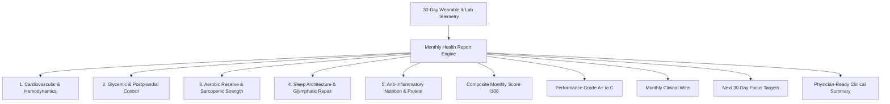

# Monthly Health Report (30-Day Longitudinal Clinical Synthesis)

## 1. Overview & Clinical Value
The **Monthly Health Report** (`MonthlyHealthReportScreen`) provides a comprehensive 30-day clinical and holistic transformation synthesis. It compiles multi-sensor wearable telemetry, biochemical records, and daily habits into a unified scorecard.

The report bridges the gap between daily consumer wellness metrics and rigorous clinical documentation by offering:
- An overall **Composite Transformation Score** ($0 - 100$) and Performance Grade (A+, A, B, C).
- Biological age evolution and trajectory delta.
- A **5-Pillar Scorecard** covering Cardiovascular, Glycemic, Musculoskeletal, Sleep, and Anti-Inflammatory Nutrition.
- Major monthly clinical wins with Karma rewards.
- Actionable priority focus targets for the upcoming 30 days.
- A **Doctor-Ready Clinical Briefing** suitable for sharing with primary care physicians or Ayurvedic doctors.

---

## 2. 5 Health Pillars

### Performance Grading Tiers:
| Grade | Status (Hindi / Sanskrit) | Min Score | Description |
| :--- | :--- | :--- | :--- |
| **A+** | उत्कृष्ट (*Utkrisht*) | $90$ | Exceptional physiological adherence & rejuvenation |
| **A** | उत्तम (*Uttam*) | $80$ | Optimal baseline stability across all biomarkers |
| **B** | मध्यम (*Madhyam*) | $70$ | Moderate progress with specific lifestyle targets |
| **C** | ध्यान आवश्यक (*Dhyan Aavashyak*) | $0$ | Elevated clinical strain requiring structured protocols |

---

## 3. Scoring Formulations

### Composite Monthly Health Score ($S_{\text{monthly}}$):
$$S_{\text{monthly}} = (0.22 \cdot S_{\text{Cardio}}) + (0.22 \cdot S_{\text{Glycemic}}) + (0.20 \cdot S_{\text{Fitness}}) + (0.18 \cdot S_{\text{Sleep}}) + (0.18 \cdot S_{\text{Nutrition}})$$

---

## 4. Source Files Reference
- **Domain Models**: [`lib/features/predictive_health/domain/monthly_report_models.dart`](file:///f:/fitkarma/lib/features/predictive_health/domain/monthly_report_models.dart)
- **Deterministic Engine**: [`lib/features/predictive_health/domain/monthly_report_engine.dart`](file:///f:/fitkarma/lib/features/predictive_health/domain/monthly_report_engine.dart)
- **State Provider**: [`lib/features/predictive_health/presentation/providers/monthly_report_provider.dart`](file:///f:/fitkarma/lib/features/predictive_health/presentation/providers/monthly_report_provider.dart)
- **UI Screen**: [`lib/features/predictive_health/presentation/monthly_report_screen.dart`](file:///f:/fitkarma/lib/features/predictive_health/presentation/monthly_report_screen.dart)
- **Unit & Offline Tests**: [`test/features/predictive_health/monthly_report_test.dart`](file:///f:/fitkarma/test/features/predictive_health/monthly_report_test.dart)

---

## 5. Offline Verification & Security
- **100% Deterministic & Offline**: Generates full 30-day summaries, pillar scores, grade classifications, and doctor export summaries completely on-device without cloud connectivity.
- **Firestore Security Rules**: User monthly report snapshots are stored under `/users/{userId}/monthlyReports/{reportId}` protected with strict owner-only read/write access.
