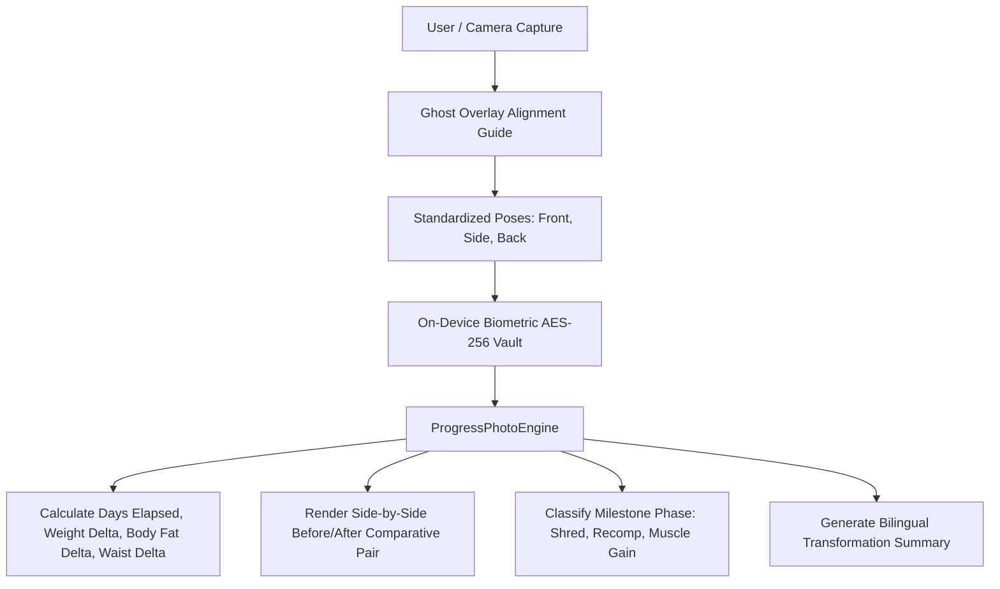

# Progress Photo System & Encrypted Vault

## 1. Overview & Privacy Architecture
The **Progress Photo System** (`ProgressPhotoScreen`) provides users with a private, client-side encrypted vault for tracking physical body transformation over time with standardized poses, ghost overlay guidance, and side-by-side milestone comparisons.

Key Privacy & Technical Pillars:
- **On-Device AES-256 Vault**: All captured transformation photos are encrypted locally using biometric keys. Zero unencrypted images are transmitted to external servers.
- **Ghost Overlay Capture Guide**: Translucent silhouette of the baseline Day 1 photo renders over the camera preview to guarantee matching posture, distance (2m), and framing across 3 standardized angles:
  - *Front View (सम्मुख दृश्य)*
  - *Side Profile (पार्श्व दृश्य)*
  - *Back View (पृष्ठ दृश्य)*
- **Comparative Transformation Engine**: Evaluates time elapsed, weight delta, body fat % delta, and waist circumference delta between any two milestones (e.g. Day 1 vs Day 30 vs Day 90).
- **Milestone Phase Tagging**: Baseline Day 1, Fat Loss & Shred (*Meda Kshaya*), Lean Muscle Gain (*Mamsa Vardhana*), Body Recomposition, and Maintenance.

---

## 2. System Architecture

### Milestone Transformation Phases:
| Phase Tag | Sanskrit / Hindi | Objective |
| :--- | :--- | :--- |
| **Baseline Day 1** | प्रारंभिक दिवस | Benchmark reference photo & initial biometric anchor |
| **Fat Loss & Shred** | मेद क्षय व कसावट | Caloric deficit phase targeting visceral & subcutaneous lipid reduction |
| **Lean Muscle Gain** | मांसपेशी संवर्धन | Hypertrophy phase with positive nitrogen balance and Mamsa Dhatu tone |
| **Body Recomposition** | शारीरिक पुनर्गठन | Simultaneous fat loss and muscle retention at maintenance calories |
| **Peak Maintenance** | संतुलन व स्थिरीकरण | Long-term sustainable physique equilibrium |

---

## 3. Source Files Reference
- **Domain Models**: [`lib/features/body_analytics/domain/progress_photo_models.dart`](file:///f:/fitkarma/lib/features/body_analytics/domain/progress_photo_models.dart)
- **Deterministic Engine**: [`lib/features/body_analytics/domain/progress_photo_engine.dart`](file:///f:/fitkarma/lib/features/body_analytics/domain/progress_photo_engine.dart)
- **State Provider**: [`lib/features/body_analytics/presentation/providers/progress_photo_provider.dart`](file:///f:/fitkarma/lib/features/body_analytics/presentation/providers/progress_photo_provider.dart)
- **UI Screen**: [`lib/features/body_analytics/presentation/progress_photo_screen.dart`](file:///f:/fitkarma/lib/features/body_analytics/presentation/progress_photo_screen.dart)
- **Unit & Offline Tests**: [`test/features/body_analytics/progress_photo_test.dart`](file:///f:/fitkarma/test/features/body_analytics/progress_photo_test.dart)

---

## 4. Offline Verification & Security
- **100% Deterministic & Offline**: All comparative pair metrics, transformation delta calculations, and vault index management run locally in pure Dart.
- **Firestore Security Rules**: Photo metadata (hashes, timestamps, weight at capture) is isolated under `/users/{userId}/progressPhotos/{photoId}` with strict `isOwner(userId)` verification in [`firestore.rules`](file:///f:/fitkarma/firestore.rules). Actual binary images remain encrypted on-device.
