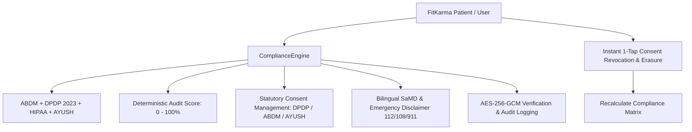

# Regulatory & Clinical Compliance Framework

## 1. Overview & Healthcare Privacy Architecture
The **Regulatory & Clinical Compliance Framework** (`ComplianceScreen`) establishes FitKarma's end-to-end alignment with national and international healthcare data privacy standards, Software-as-a-Medical-Device (SaMD) disclaimers, and Ayushman Bharat Digital Mission (ABDM) guidelines.

FitKarma adheres to four primary regulatory pillars:
1. **Digital Personal Data Protection (DPDP) Act 2023 (India)**: Explicit, purposeful consent, user right to access & complete erasure (Section 12), and localized biometric storage.
2. **Ayushman Bharat Digital Mission (ABDM - National Health Authority)**: Consent artifact management, FHIR standard health data exchange, and ABHA interoperability.
3. **HIPAA Privacy & Security Rules (USA / Global)**: Minimum necessary disclosure rule, AES-256 telemetry encryption at rest, and tamper-evident audit logging.
4. **Ministry of AYUSH Practice Guidelines (India)**: Standardized Ayurvedic terminology for Dosha balance, Dinacharya circadian rhythms, and Rasayana lifestyle guidance.

---

## 2. Compliance & Consent Architecture

### Statutory Framework Matrix:
| Standard | Jurisdiction | Regional Title | Key Requirements |
| :--- | :--- | :--- | :--- |
| **ABDM** | India (NHA) | आयुष्मान भारत डिजिटल मिशन | FHIR interoperability, ABHA ID linkage, Consent manager |
| **DPDP Act 2023** | India | डेटा संरक्षण अधिनियम २०२३ | Purpose limitation, Right to erasure, Explicit opt-in consent |
| **HIPAA Security** | US / Global | HIPAA डेटा गोपनीयता मानक | AES-256 telemetry encryption, Tamper-evident audit trails |
| **AYUSH Guidelines** | India (AYUSH) | आयुष पारंपरिक स्वास्थ्य दिशानिर्देश | Evidence-informed Dinacharya, Ritucharya & Dosha standards |

---

## 3. Clinical & SaMD Disclaimer & Safety Rules
- **Non-Diagnostic Notice**: FitKarma explicitly clarifies in English and Hindi that its AI insights and Ayurvedic health scores provide preventive lifestyle guidance and risk stratification—not clinical diagnosis or prescription.
- **Emergency Helplines**: Displays prominent national emergency access numbers (**112 / 108** for India, **911** for US).
- **Pure Dart Deterministic Evaluation**: 100% offline verifiable consent auditing, scoring, and cryptographic safeguard verification.

---

## 4. Source Files Reference
- **Domain Models**: [`lib/features/predictive_health/domain/compliance_models.dart`](file:///f:/fitkarma/lib/features/predictive_health/domain/compliance_models.dart)
- **Deterministic Engine**: [`lib/features/predictive_health/domain/compliance_engine.dart`](file:///f:/fitkarma/lib/features/predictive_health/domain/compliance_engine.dart)
- **State Provider**: [`lib/features/predictive_health/presentation/providers/compliance_provider.dart`](file:///f:/fitkarma/lib/features/predictive_health/presentation/providers/compliance_provider.dart)
- **UI Screen**: [`lib/features/predictive_health/presentation/compliance_screen.dart`](file:///f:/fitkarma/lib/features/predictive_health/presentation/compliance_screen.dart)
- **Unit & Offline Tests**: [`test/features/predictive_health/compliance_test.dart`](file:///f:/fitkarma/test/features/predictive_health/compliance_test.dart)

---

## 5. Offline Verification & Security Rules
- **Pure Dart Logic**: Zero cloud dependencies required for consent audits or disclaimer validation.
- **Data Isolation**: User consents and compliance audit events are isolated under `/users/{userId}/compliance/{docId}` with strict `isOwner(userId)` verification in [`firestore.rules`](file:///f:/fitkarma/firestore.rules).
