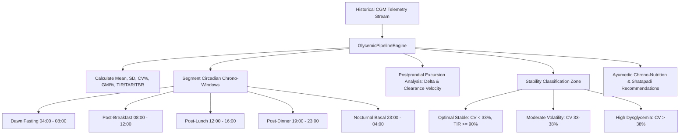

# Retrospective Glycemic Processing Pipeline

## 1. Overview & Metabolic Longevity
The **Retrospective Glycemic Processing Pipeline** (`GlycemicPipelineScreen`) analyzes multi-week and multi-month continuous glucose telemetry (CGM) to uncover retrospective glycemic variability, circadian excursion patterns, and chrono-nutritional correlations.

By moving beyond single-point fasting glucose or isolated HbA1c metrics, this pipeline evaluates:
- **Glycemic Variability (Coefficient of Variation CV %)**: Target `< 33%` for optimal cellular homeostasis.
- **Glucose Management Indicator (GMI %)**: Derived laboratory HbA1c estimation using the standard formula:
  $$\text{GMI (\%)} = 3.31 + (0.02392 \times \text{Mean Glucose mg/dL})$$
- **Time in Range (TIR 70–140 mg/dL)**: Percentage of time in target non-diabetic metabolic health zone.
- **24-Hour Circadian Segmentation**: Dawn fasting phenomenon, post-breakfast, post-lunch, post-dinner clearance velocity, and nocturnal dipping.
- **Postprandial Excursion Dynamics**: Peak delta rise, clearance velocity (hours), and meal spike blunting strategies (e.g. 100-step *Shatapadi* walk, soluble fenugreek fiber).

---

## 2. Pipeline & Processing Architecture

### Chrono-Glycemic Windows:
| Window | Hindi / Sanskrit | Focus Area |
| :--- | :--- | :--- |
| **Dawn & Fasting** | उषाकाल व प्रभात शर्करा | Hepatic gluconeogenesis & Cortisol awakening spike |
| **Post-Breakfast** | प्रातराश उपरांत | Morning carb sensitivity & Agni activation |
| **Post-Lunch** | मध्याह्न भोजन उपरांत | Peak metabolic fire & Shatapadi walk impact |
| **Post-Dinner** | रात्रि भोजन उपरांत | Kapha time clearance & pre-bedtime clearance rate |
| **Nocturnal Basal** | निशि काल शर्करा | Deep sleep stability & nocturnal hypoglycemia dipping |

---

## 3. Source Files Reference
- **Domain Models**: [`lib/features/predictive_health/domain/glycemic_pipeline_models.dart`](file:///f:/fitkarma/lib/features/predictive_health/domain/glycemic_pipeline_models.dart)
- **Deterministic Engine**: [`lib/features/predictive_health/domain/glycemic_pipeline_engine.dart`](file:///f:/fitkarma/lib/features/predictive_health/domain/glycemic_pipeline_engine.dart)
- **State Provider**: [`lib/features/predictive_health/presentation/providers/glycemic_pipeline_provider.dart`](file:///f:/fitkarma/lib/features/predictive_health/presentation/providers/glycemic_pipeline_provider.dart)
- **UI Screen**: [`lib/features/predictive_health/presentation/glycemic_pipeline_screen.dart`](file:///f:/fitkarma/lib/features/predictive_health/presentation/glycemic_pipeline_screen.dart)
- **Unit & Offline Tests**: [`test/features/predictive_health/glycemic_pipeline_test.dart`](file:///f:/fitkarma/test/features/predictive_health/glycemic_pipeline_test.dart)

---

## 4. Offline Verification & Security
- **100% Deterministic & Offline**: All statistical aggregations, GMI conversions, circadian segmentation, and excursion detection execute on-device in pure Dart.
- **Firestore Security Rules**: Historical glucose datasets are stored under `/users/{userId}/glucoseTelemetry/{sampleId}` with strict owner-only access in [`firestore.rules`](file:///f:/fitkarma/firestore.rules).
