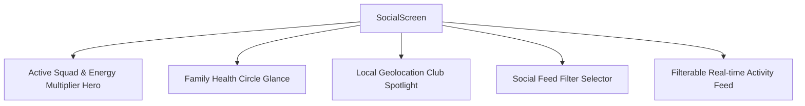

# Social Screen (Sangha, Squads & Family Circles)

## 1. Overview & Cultural Philosophy
The **Social Screen** (`SocialScreen`) is FitKarma's community hub, anchoring user engagement in **Sangha (सामूहिक साधना)** and **Parivar (पारिवारिक स्वास्थ्य)**. Moving away from superficial vanity metrics and comparison culture, FitKarma Social emphasizes:
- **Mutual Accountability (Dal / Squads)**: 3-8 member squads that multiply collective Karma.
- **Intergenerational Care (Family Circles)**: Proactive health monitoring and gentle Shatpawali reminders for elders and parents.
- **Positive Celebration (Activity Feed & Kudos)**: Real-time celebratory stream for PRs, streaks, and health milestones.
- **Local Geolocation Clubs (Kshetra Circles)**: Neighborhood walking, running, and calisthenics groups.

---

## 2. Visual Layout & Component Architecture

### Key UI Sections:
- **Active Squad Hero Bento**:
  - Displays squad streak, member count, member avatar chips, and an active [`GlowingMetric`](file:///f:/fitkarma/lib/shared/widgets/glowing_metric.dart) with the collective squad multiplier ($1.00\text{x} - 1.35\text{x}$).
- **Family Health Circle**:
  - Tracks parents' daily steps, blood pressure logging status, and proactive evening Shatpawali reminders.
- **Local Club Spotlight**:
  - Neighborhood circle summary with active member count and weekly collective steps.
- **Activity Feed Stream**:
  - Categorized feed posts (Workouts, Shatpawali streaks, Milestone unlocks, Tier promotions) with interactive Kudos and Karma rewards.

---

## 3. Mathematical Foundations

### Collective Squad Multiplier ($M_{\text{squad}}$)
$$M_{\text{squad}} = 1.0 + \min\left(0.20, \frac{S_{\text{streak}}}{30} \times 0.20\right) + \min\left(0.15, \frac{A_{\text{squad}}}{100} \times 0.15\right)$$

Where:
- $S_{\text{streak}}$: Continuous days where all squad members hit daily discipline.
- $A_{\text{squad}}$: Average squad adherence score ($0 - 100$).

### Intergenerational Care Rule:
$$\text{Alert Required} = (\text{Hour} \ge 18) \land (\text{Steps} < 0.40 \times \text{Daily Target})$$

---

## 4. Source Files Reference
- **Domain Models**: [`lib/features/social/domain/social_models.dart`](file:///f:/fitkarma/lib/features/social/domain/social_models.dart)
- **Deterministic Engine**: [`lib/features/social/domain/social_engine.dart`](file:///f:/fitkarma/lib/features/social/domain/social_engine.dart)
- **State Provider**: [`lib/features/social/presentation/providers/social_provider.dart`](file:///f:/fitkarma/lib/features/social/presentation/providers/social_provider.dart)
- **UI Screen**: [`lib/features/social/presentation/social_screen.dart`](file:///f:/fitkarma/lib/features/social/presentation/social_screen.dart)

---

## 5. Offline Verification & Security
- **100% Offline Resilience**: Renders cached squads, family circles, and activity feeds seamlessly when offline.
- **Security Isolation**: Data paths `/squads/{squadId}`, `/clubs/{clubId}`, and `/users/{userId}/*` are protected under Firestore rules with owner and member validation.
