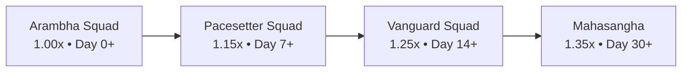

# Squad System (Micro-Squad Dynamics & Dal Accountability)

## 1. Overview & Cultural Philosophy
The **Squad System** (`SquadDetailScreen`) creates tight-knit accountability circles of 3 to 8 athletes. Rooted in the ancient Indian concept of **Dal (साधक दल)** and **Sangha Sahavasa**, it aligns daily individual discipline with collective success:
- **All-for-One Streak Multipliers**: When all squad members check in daily, the collective streak grows, unlocking tiered Karma multipliers (1.00x to 1.35x).
- **Sanjeevani Streak Shield**: A community safety net protecting collective progress during travel, illness, or rest days.
- **Daily Standup Matrix**: Real-time visibility into each member's 4 core discipline rings (Steps, Shatpawali, Workout, Nutrition).
- **Collective Sanghathons**: Group step and habit challenges distributing shared Karma reward pools.

---

## 2. Squad Tier Progression

### Tier Matrix:
| Tier | Hindi Title | Multiplier | Minimum Streak Days |
| :--- | :--- | :--- | :--- |
| **Arambha** | आरंभिक दल | 1.00x | 0 Days |
| **Abhyasi / Pacesetter** | गतिशील साधक दल | 1.15x | 7 Days |
| **Vanguard** | अग्रणी दल | 1.25x | 14 Days |
| **Mahasangha** | महासंग दल | 1.35x | 30 Days |

---

## 3. Mathematical Foundations

### Squad Check-in Rate ($R_{\text{checkin}}$)
$$R_{\text{checkin}} = \frac{N_{\text{checked\_in}}}{N_{\text{total\_members}}} \times 100$$

### All-for-One Streak Continuity Protocol:
$$\text{Streak}_{t+1} = \begin{cases} 
\text{Streak}_t + 1 & \text{if } R_{\text{checkin}} = 100\% \\ 
\text{Streak}_t & \text{if } R_{\text{checkin}} < 100\% \land \text{Sanjeevani Shield Deployed} \\
1 & \text{otherwise (graceful reset)}
\end{cases}$$

---

## 4. Source Files Reference
- **Domain Models**: [`lib/features/social/domain/squad_models.dart`](file:///f:/fitkarma/lib/features/social/domain/squad_models.dart)
- **Deterministic Engine**: [`lib/features/social/domain/squad_engine.dart`](file:///f:/fitkarma/lib/features/social/domain/squad_engine.dart)
- **State Provider**: [`lib/features/social/presentation/providers/squad_provider.dart`](file:///f:/fitkarma/lib/features/social/presentation/providers/squad_provider.dart)
- **UI Screen**: [`lib/features/social/presentation/squad_detail_screen.dart`](file:///f:/fitkarma/lib/features/social/presentation/squad_detail_screen.dart)

---

## 5. Offline Verification & Security Rules
- **100% Offline Capability**: All squad check-in calculations, multiplier resolutions, and challenge completions compute locally with pure Dart arithmetic.
- **Firestore Security Rules**: Protected under `/squads/{squadId}` where reads are available to authenticated users and writes are restricted to squad creators and enrolled members (`request.resource.data.members[request.auth.uid] != null`).
