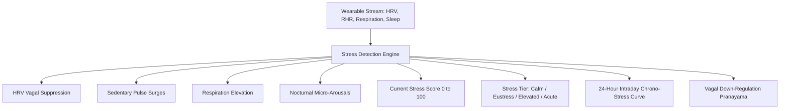

# Inferred Stress Detection Engine (Autonomic Vagal Dynamics)

## 1. Overview & Autonomic Physiology
The **Stress Detection Engine** (`StressDetectionScreen`) provides passive, continuous inferred autonomic nervous system stress tracking. Instead of relying on subjective survey prompts, the engine continuously synthesizes multi-channel passive physiological signals:
1. **Heart Rate Variability (rMSSD)**: Direct proxy for parasympathetic vagal nerve braking activity.
2. **Sedentary Tachycardia**: Spikes in resting pulse ($> 12$ bpm above baseline) during stationary periods.
3. **Respiration Pacing**: Shallow, rapid hyperventilation patterns ($> 17$ breaths/min).
4. **Nocturnal Fragmentation**: Overnight micro-arousals and restlessness elevating next-day sympathetic vulnerability.

---

## 2. Inferred Stress Architecture

### Autonomic Stress Tiers:
| Tier | Sanskrit / Hindi | Score Range | Autonomic State | Recommended Intervention |
| :--- | :--- | :--- | :--- | :--- |
| **Calm & Restorative** | शांत (*Shanta*) | $0 - 25$ | Parasympathetic dominance | Maintain routine |
| **Engaged Eustress** | सचेत (*Sachet*) | $26 - 50$ | Optimal cognitive arousal | Focused deep work |
| **Elevated Distress** | तनावग्रस्त (*Tanaav*) | $51 - 75$ | Sympathetic tone dominance | 5-min 4-7-8 Breathing |
| **Acute Overload** | अत्यधिक तनाव (*Ati-Tanaav*) | $76 - 100$ | Neuro-exhaustion spike | Immediate Bhramari Pranayama |

---

## 3. Mathematical Formulations

### Composite Inferred Stress Score ($S_{\text{stress}}$):
$$S_{\text{stress}} = \text{clamp}\left(P_{\text{HRV}} + P_{\text{RHR}} + P_{\text{Resp}} + P_{\text{Sleep}}, 5.0, 98.0\right)$$

Where points $P$ reflect deviations from 30-day individual baseline:
- $P_{\text{HRV}} = f(\text{rMSSD}_{\text{current}} / \text{rMSSD}_{\text{baseline}})$
- $P_{\text{RHR}} = f(\text{RHR}_{\text{current}} - \text{RHR}_{\text{baseline}})$
- $P_{\text{Resp}} = f(\text{RespRate}_{\text{current}} - \text{RespRate}_{\text{baseline}})$
- $P_{\text{Sleep}} = f(\text{MicroArousals}_{\text{nocturnal}})$

---

## 4. Source Files Reference
- **Domain Models**: [`lib/features/predictive_health/domain/stress_detection_models.dart`](file:///f:/fitkarma/lib/features/predictive_health/domain/stress_detection_models.dart)
- **Deterministic Engine**: [`lib/features/predictive_health/domain/stress_detection_engine.dart`](file:///f:/fitkarma/lib/features/predictive_health/domain/stress_detection_engine.dart)
- **State Provider**: [`lib/features/predictive_health/presentation/providers/stress_detection_provider.dart`](file:///f:/fitkarma/lib/features/predictive_health/presentation/providers/stress_detection_provider.dart)
- **UI Screen**: [`lib/features/predictive_health/presentation/stress_detection_screen.dart`](file:///f:/fitkarma/lib/features/predictive_health/presentation/stress_detection_screen.dart)
- **Unit & Offline Tests**: [`test/features/predictive_health/stress_detection_test.dart`](file:///f:/fitkarma/test/features/predictive_health/stress_detection_test.dart)

---

## 5. Offline Verification & Security
- **100% Deterministic & Offline**: All signal weighting, circadian curve modeling, and protocol selection run on-device in pure Dart with zero cloud dependencies.
- **Firestore Security Rules**: User stress records are stored under `/users/{userId}/stressReadings/{readingId}` protected with strict owner-only access.
