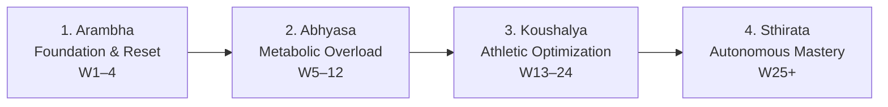

# Transformation Journey Engine

## 1. Overview & Holistic Philosophy
The **Transformation Journey Engine** powers longitudinal physical and metabolic tracking across an athlete's lifecycle on FitKarma. Moving beyond vanity scale metrics, it tracks multi-pillar biometric evolution calibrated for South Asian cardiometabolic phenotypes (WHtR, resting heart rate, blood pressure, estimated HbA1c, VO2 Max, training tonnage, and Ayurvedic Dosha harmony).

---

## 2. Transformation Stages (Yatra Charan)

### Stage Thresholds & Focus:
1. **Arambha (Weeks 1–4, $T_s < 35$)**: Circadian reset, Shatpawali seeding, baseline habit formation.
2. **Abhyasa (Weeks 5–12, $35 \le T_s < 65$)**: Progressive overload, visceral fat reduction, insulin sensitivity optimization.
3. **Koushalya (Weeks 13–24, $65 \le T_s < 85$)**: Lean tissue accretion, VO2 Max expansion, Dosha equilibrium.
4. **Sthirata (Weeks 25+, $T_s \ge 85$)**: Autonomous habit automaticity, long-term biomarker maintenance, Sangha mentorship.

---

## 3. Mathematical Foundations

### Multi-Pillar Progress Contribution ($P_i$)
For any metric $i$ with baseline $X_0$, current value $X_t$, and clinical goal target $X_g$:

**Lower-is-better metrics (WHtR, RHR, SBP, HbA1c):**
$$P_i = \min\left(100, \max\left(0, \frac{X_0 - X_t}{X_0 - X_g} \times 100\right)\right)$$

**Higher-is-better metrics (VO2 Max, Steps, Volume, Dosha, Karma):**
$$P_i = \min\left(100, \max\left(0, \frac{X_t - X_0}{X_g - X_0} \times 100\right)\right)$$

### Composite Transformation Score ($T_s$)
$$T_s = 0.25 \bar{P}_{\text{BodyComp}} + 0.25 \bar{P}_{\text{Cardiometabolic}} + 0.20 \bar{P}_{\text{WorkCapacity}} + 0.15 P_{\text{Dosha}} + 0.15 P_{\text{Karma}}$$

### Velocity & Projection Model
Weekly rate of change:
$$V_w = \frac{X_0 - X_t}{\text{Weeks Elapsed}}$$
Estimated days remaining to target:
$$D_{\text{rem}} = \text{clamp}\left(7, 180, \frac{|X_t - X_g|}{V_w} \times 7\right)$$

---

## 4. Source Files Reference
- **Domain Models**: [`lib/features/transformation/domain/transformation_models.dart`](file:///f:/fitkarma/lib/features/transformation/domain/transformation_models.dart)
- **Deterministic Engine**: [`lib/features/transformation/domain/transformation_engine.dart`](file:///f:/fitkarma/lib/features/transformation/domain/transformation_engine.dart)
- **State Provider**: [`lib/features/transformation/presentation/providers/transformation_provider.dart`](file:///f:/fitkarma/lib/features/transformation/presentation/providers/transformation_provider.dart)

---

## 5. Offline Verification & Security
- **100% Offline Capability**: All trajectory curves, milestone detections, and composite scores compute locally with pure Dart arithmetic.
- **Data Isolation**: User longitudinal snapshots and milestone logs are secured under `/users/{userId}/transformationSnapshots` and `/users/{userId}/milestones` (strictly isolated by Firestore rules).
