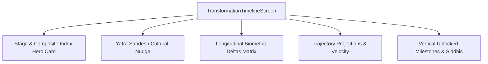

# Transformation Timeline Screen

## 1. Overview & Visual Architecture
The **Transformation Timeline Screen** (`TransformationTimelineScreen`) provides an immersive, longitudinal visualization of an athlete's physical, cardiometabolic, and behavioral evolution on FitKarma. It blends modern Bento-grid UI with Vedic stage progression (*Arambha*, *Abhyasa*, *Koushalya*, *Sthirata*), offering side-by-side biomarker deltas, trajectory velocity forecasting, and milestone unlocks.

---

## 2. Visual Layout & Component Flow

### Key UI Components:
- **Stage Hero Card**:
  - Displays the active *Yatra Charan* (Stage 1 to 4) with dedicated tint badges.
  - Features a [`GlowingMetric`](file:///f:/fitkarma/lib/shared/widgets/glowing_metric.dart) displaying the composite transformation percentage ($T_s$).
  - Journey Day tracker and stage progress bar.
- **Longitudinal Biometric Deltas**:
  - Displays Baseline (Day 1) vs Current values for key South Asian health markers:
    - Waist-to-Height Ratio (WHtR, target $<0.50$).
    - Resting Heart Rate (RHR, BPM).
    - Systolic / Diastolic Blood Pressure (mmHg).
    - Estimated HbA1c (%).
    - VO2 Max fitness (ml/kg/min).
    - Step volume & weekly tonnage.
  - Percentage shift and progress contribution indicators.
- **Biometric Trajectory Forecaster**:
  - Velocity extrapolation providing remaining days count to target milestones.
- **Milestone Timeline (*Siddhi*)**:
  - Chronological badges with earned Karma rewards and bilingual descriptions.

---

## 3. Design Tokens & Consistency
- **Colors**: `AppColors.background`, `AppColors.surface`, `AppColors.surfaceElevated`, `AppColors.karmaGreen`, `AppColors.focusBlue`, `AppColors.gold`, `AppColors.energyOrange`.
- **Typography**: `AppTypography.displayMedium`, `AppTypography.titleLarge`, `AppTypography.titleMedium`, `AppTypography.bodyMedium`, `AppTypography.bodySmall`, `AppTypography.metricLabel`.
- **Bento Card Structure**: Pure `BentoCard` encapsulation with clean glassmorphic elevations.

---

## 4. Source Files Reference
- **UI Screen**: [`lib/features/transformation/presentation/transformation_timeline_screen.dart`](file:///f:/fitkarma/lib/features/transformation/presentation/transformation_timeline_screen.dart)
- **Domain Models**: [`lib/features/transformation/domain/transformation_models.dart`](file:///f:/fitkarma/lib/features/transformation/domain/transformation_models.dart)
- **Engine**: [`lib/features/transformation/domain/transformation_engine.dart`](file:///f:/fitkarma/lib/features/transformation/domain/transformation_engine.dart)
- **State Provider**: [`lib/features/transformation/presentation/providers/transformation_provider.dart`](file:///f:/fitkarma/lib/features/transformation/presentation/providers/transformation_provider.dart)

---

## 5. Offline Verification & Security
- **100% Offline**: All metrics, progress bar fractions, and trajectory calculations render deterministically from local cached snapshots.
- **Firestore Security**: User subcollection `/users/{userId}/transformationSnapshots` is fully protected by owner isolation rules.
