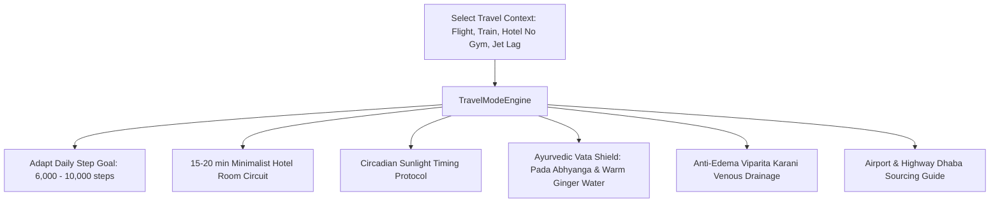

# Travel Intelligence (Travel Mode)

## 1. Overview & Mobile Wellness Architecture
The **Travel Intelligence System** (`TravelModeScreen`) dynamically adapts fitness anchors, circadian biology, and nutritional choices for users on the move across flights, trains, road trips, and international hotel stays.

Key Capabilities:
- **Travel Contexts**: Flight Transit, Train/Road Trips, Hotel (No Gym / Minimal Space), Hotel (With Gym), and International Cross-Timezone Jet Lag.
- **Circadian Jet Lag & Sunlight Timing**: Calculated morning sunlight anchors to reset the suprachiasmatic nucleus (SCN) and align meal timing to local destination hours.
- **Hotel Room Minimalist Workouts**: 15–20 minute bodyweight HIIT supersets (squats, bed dips, pushups, wall-sits) requiring zero equipment.
- **Anti-Edema & Circulation Protocol**: *Viparita Karani* (Legs-Up-The-Wall for 10 minutes) and ankle pump routines to drain venous pooling after long journeys.
- **Ayurvedic Vata Travel Shield**: Motion inherently aggravates *Vata dosha* (dryness, restlessness, constipation). Prescribes warm sesame oil foot massage (*Pada Abhyanga*) before sleep, ginger water, and warm cooked meals.
- **Airport & Highway Dhaba Dining Survival Guide**: Healthy whole food sourcing (steamed idlis, dal tadka, tandoori roti, chaas) over processed fast food.

---

## 2. Travel Adaptation Pipeline

### Travel Context Matrix:
| Context | Sanskrit / Hindi | Step Target | Focus Protocol |
| :--- | :--- | :--- | :--- |
| **Flight Transit** | हवाई यात्रा एवं पारगमन | 6,000 | 250ml/hr hydration & Viparita Karani leg elevation |
| **Train / Road Trip** | रेल व सड़क यात्रा | 6,000 | Dhaba dal tadka/chaas & highway mobility breaks |
| **Hotel (No Gym)** | होटल प्रवास (बिना जिम) | 8,000 | 20-min bed dip / bodyweight circuit & buffet pacing |
| **Hotel (With Gym)** | होटल प्रवास (जिम युक्त) | 10,000 | 35-min equipment workout & balanced recovery |
| **International Jet Lag** | समय क्षेत्र परिवर्तन (जेट लैग) | 7,000 | Destination morning sunlight & Pada Abhyanga foot massage |

---

## 3. Source Files Reference
- **Domain Models**: [`lib/features/festival_life_events/domain/travel_mode_models.dart`](file:///f:/fitkarma/lib/features/festival_life_events/domain/travel_mode_models.dart)
- **Deterministic Engine**: [`lib/features/festival_life_events/domain/travel_mode_engine.dart`](file:///f:/fitkarma/lib/features/festival_life_events/domain/travel_mode_engine.dart)
- **State Provider**: [`lib/features/festival_life_events/presentation/providers/travel_mode_provider.dart`](file:///f:/fitkarma/lib/features/festival_life_events/presentation/providers/travel_mode_provider.dart)
- **UI Screen**: [`lib/features/festival_life_events/presentation/travel_mode_screen.dart`](file:///f:/fitkarma/lib/features/festival_life_events/presentation/travel_mode_screen.dart)
- **Unit & Offline Tests**: [`test/features/festival_life_events/travel_mode_test.dart`](file:///f:/fitkarma/test/features/festival_life_events/travel_mode_test.dart)

---

## 4. Offline Verification & Security
- **100% Deterministic & Pure Dart**: Travel mode algorithms, hotel workout circuits, and jet lag calculators operate completely offline without internet or roaming data.
- **Firestore Security Rules**: User travel preferences and active destination records are isolated under `/users/{userId}/travelState/{stateId}` with strict `isOwner(userId)` verification in [`firestore.rules`](file:///f:/fitkarma/firestore.rules).
