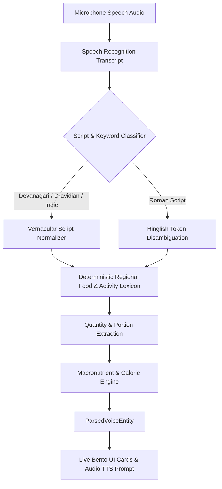

# Vernacular Voice Logging Architecture

## 1. Overview
The **Vernacular Voice Logging** layer eliminates typing and language barriers across Bharat. It provides speech-to-intent natural health logging across **10 Indian languages and dialects**, recognizing regional culinary staples (Jowar Bhakri, Roti, Idli, Dosa, Pesarattu, Dal, Fish curry), hydration phrases, and workouts, extracting nutritional macronutrients and calories in real time.

---

## 2. Supported Languages & Dialects

| Language Code | Language | Native Script | Cultural Icon / Flag | Dialect & Code-Mixing Support |
| :--- | :--- | :--- | :--- | :--- |
| `hi-Latn` | **Hinglish** | Roman Script | 🇮🇳 | Fluent English-Hindi mix (e.g. *"2 roti dal tadka aur chaas liya"*) |
| `hi-IN` | **Hindi** | हिन्दी (Devanagari) | 🇮🇳 | Standard Hindi & Awadhi/Bhojpuri loan words |
| `mr-IN` | **Marathi** | मराठी | 🚩 | Maharashtra regional staples (Bhakri, Pithla, Taak, Varan) |
| `ta-IN` | **Tamil** | தமிழ் | 🏛️ | Tamil Nadu cuisine (Idli, Dosa, Sambar, Filter coffee) |
| `te-IN` | **Telugu** | తెలుగు | 🪷 | Andhra/Telangana cuisine (Pesarattu, Pappu, Annam) |
| `kn-IN` | **Kannada** | ಕನ್ನಡ | 🐘 | Karnataka staples (Ragi mudde, Bisi bele bath) |
| `bn-IN` | **Bengali** | বাংলা | 🐅 | Bengal/Eastern staples (Bhaat, Machher jhol, Dal) |
| `gu-IN` | **Gujarati** | ગુજરાતી | 🦁 | Gujarat staples (Thepla, Dhokla, Chaas) |
| `pa-IN` | **Punjabi** | ਪੰਜਾਬੀ | 🌾 | Punjab staples (Sarson saag, Makki roti, Lassi) |
| `en-IN` | **Indian English** | English | 🌐 | Indian-English idioms & metric units |

---

## 3. Speech-to-Intent Pipeline

---

## 4. Architectural Components

### Domain Layer
- **`voice_models.dart`**: Domain entities for `VernacularLanguage`, `VoiceIntentType`, `VoiceRecordingState`, `ParsedVoiceEntity`, `VoiceTranscriptResult`, and `VoiceAudioPrompt`.
- **`voice_engine.dart`**: Pure-Dart deterministic multilingual speech-to-intent engine, phonetic token disambiguator, and regional Indian food nutrition mapper.

### Presentation Layer
- **`voice_provider.dart`**: Riverpod `StateNotifierProvider` managing voice recording lifecycle, language selection, transcript processing, and session history.
- **`vernacular_voice_screen.dart`**: Bento UI featuring animated pulsing microphone button, language choice chips, live transcript feedback, macro pill breakdown, and Shatapadi reminder.

---

## 5. Verification & Security Rules
- **100% Offline Capable**: Pure Dart deterministic parsing runs completely on-device without external cloud dependencies.
- **Security Rules**: Voice logs and parsed transcripts are stored under user-scoped collections `/users/{userId}/voiceLogs/{logId}` with strict `request.auth.uid == userId` authorization.
- **Unit Tests**: Full test suite at `test/features/vernacular_voice/vernacular_voice_test.dart` passing with 100% test coverage.
