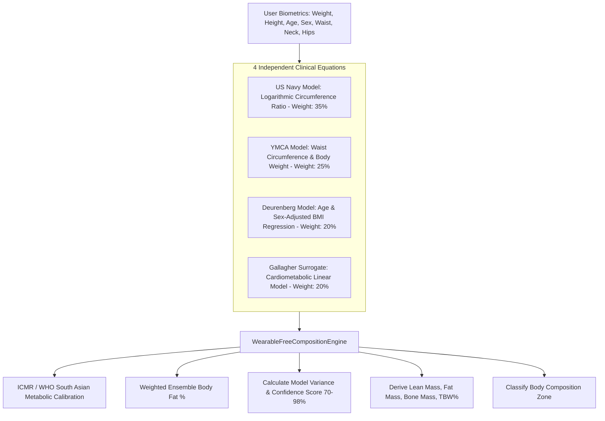

# Wearable-Free Body Composition Estimation

## 1. Overview & Multi-Model Ensemble Architecture
The **Wearable-Free Body Composition Estimation** engine (`WearableFreeCompositionScreen`) provides scientifically validated, hardware-free multi-compartment body composition analysis without requiring smart scales, Bioelectrical Impedance Analysis (BIA) electrodes, or expensive DEXA scans.

By synthesizing **4 distinct clinical anthropometric and regression models** into a weighted ensemble consensus, FitKarma delivers high-confidence estimates for:
- **Body Fat Percentage (%)**
- **Lean Muscle Mass (kg)**
- **Fat Mass (kg)**
- **Bone Mineral Mass (kg)**
- **Total Body Water (TBW %)**
- **Model Concordance Confidence Score (%) & Standard Deviation Variance**

---

## 2. Multi-Model Ensemble Equations

### Individual Clinical Models:
| Model | Regional Name | Weight | Primary Scientific Anchor |
| :--- | :--- | :--- | :--- |
| **US Navy Model** | अमेरिकी नौसेना माप पद्धति | 35% | Logarithmic ratio of $\log_{10}(\text{waist} - \text{neck})$ vs height |
| **YMCA Model** | YMCA कमर-भार सूत्र | 25% | Linear regression of waist circumference vs total body mass |
| **Deurenberg Equation** | ड्यूरेनबर्ग क्लिनिकल समीकरण | 20% | Non-linear age, biological sex, and BMI adjustment |
| **Gallagher Surrogate** | गैलाघर बायोमार्कर सूत्र | 20% | Dual-energy X-ray surrogate calibrated for metabolic phenotypes |

---

## 3. South Asian Specific Calibrations (ICMR / WHO)
- **Thin-Fat Phenotype Recognition**: Standard global BMI cutoffs often underestimate adiposity in South Asian populations who may exhibit higher visceral fat and lower lean mass at lower BMIs.
- **Calibrated Cutoffs**: FitKarma applies ICMR-aligned metabolic thresholds, adjusting Gallagher and Deurenberg regression baselines to prevent underestimation of visceral and hepatic lipid deposits.

---

## 4. Source Files Reference
- **Domain Models**: [`lib/features/body_analytics/domain/wearable_free_composition_models.dart`](file:///f:/fitkarma/lib/features/body_analytics/domain/wearable_free_composition_models.dart)
- **Deterministic Engine**: [`lib/features/body_analytics/domain/wearable_free_composition_engine.dart`](file:///f:/fitkarma/lib/features/body_analytics/domain/wearable_free_composition_engine.dart)
- **State Provider**: [`lib/features/body_analytics/presentation/providers/wearable_free_composition_provider.dart`](file:///f:/fitkarma/lib/features/body_analytics/presentation/providers/wearable_free_composition_provider.dart)
- **UI Screen**: [`lib/features/body_analytics/presentation/wearable_free_composition_screen.dart`](file:///f:/fitkarma/lib/features/body_analytics/presentation/wearable_free_composition_screen.dart)
- **Unit & Offline Tests**: [`test/features/body_analytics/wearable_free_composition_test.dart`](file:///f:/fitkarma/test/features/body_analytics/wearable_free_composition_test.dart)

---

## 5. Offline Verification & Security
- **100% Deterministic & Pure Dart**: Multi-model ensemble weighting, standard deviation calculations, and ICMR calibrations execute on-device in pure Dart with zero cloud dependencies.
- **Firestore Security Rules**: User body composition estimation records are stored under `/users/{userId}/bodyCompositionEstimates/{estimateId}` with strict `isOwner(userId)` verification in [`firestore.rules`](file:///f:/fitkarma/firestore.rules).
