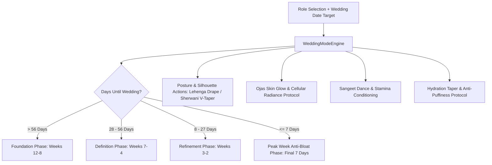

# Wedding Transformation Mode

## 1. Overview & Bridal / Groom Periodization
The **Wedding Transformation Mode** (`WeddingModeScreen`) orchestrates targeted, high-stakes aesthetic, posture, and wellness countdowns tailored for Indian weddings.

Key Architectural Capabilities:
- **Role-Specific Tailoring**:
  - **Bride (वधू)**: Open decolletage posture, thoracic spine mobility for heavy bridal lehenga/dupatta drape, and waist taper.
  - **Groom (वर)**: Upper lat and lateral deltoid width for an athletic V-taper frame under tailored sherwanis.
  - **Close Family / Parents**: Hip flexor mobility and joint resilience for multi-hour standing and rituals.
  - **Bridal Party / Sangeet Friends**: Cardiovascular conditioning for Sangeet dance performances.
- **4-Phase Countdown Periodization**:
  1. *Foundation & Recomposition (Weeks 12–8)*: High-protein fat loss & core structure.
  2. *Sculpting & Definition (Weeks 7–4)*: Deltoid and postural accentuation.
  3. *Skin Glow & Posture Refinement (Weeks 3–2)*: Ojas nourishment & stress mitigation.
  4. *Peak Week & Anti-Bloat Protocol (Final 7 Days)*: Safe sodium pacing, potassium loading, zero gas-forming cruciferous vegetables, and gentle de-bloat teas.
- **Ayurvedic Ojas Skin Radiance Protocol**: Golden saffron-turmeric milk, Amla-Aloe vera antioxidant tonics, and Abhyanga massage to ensure vibrant *Rasa & Rakta Dhatu* skin glow.

---

## 2. Transformation Pipeline Architecture

### Wedding Role Archetypes:
| Role | Sanskrit / Hindi | Primary Silhouette Focus | Key Pillar Action |
| :--- | :--- | :--- | :--- |
| **Bride** | वधू (दुल्हन) | Open shoulders, upright drape, glowing skin | Scapular retractions & Saffron-Amla Ojas protocol |
| **Groom** | वर (दूल्हा) | Upper back width, lateral deltoids & V-taper | Lateral raises & Wide-grip pull-ups |
| **Close Family** | परिवार के मुख्य सदस्य | Standing stamina & lower back comfort | Hip decompression & joint mobility |
| **Bridal Party** | सहेली / बाराती मित्र | High-tempo choreography stamina & lean tone | Sangeet interval training & core pivots |

---

## 3. Source Files Reference
- **Domain Models**: [`lib/features/festival_life_events/domain/wedding_mode_models.dart`](file:///f:/fitkarma/lib/features/festival_life_events/domain/wedding_mode_models.dart)
- **Deterministic Engine**: [`lib/features/festival_life_events/domain/wedding_mode_engine.dart`](file:///f:/fitkarma/lib/features/festival_life_events/domain/wedding_mode_engine.dart)
- **State Provider**: [`lib/features/festival_life_events/presentation/providers/wedding_mode_provider.dart`](file:///f:/fitkarma/lib/features/festival_life_events/presentation/providers/wedding_mode_provider.dart)
- **UI Screen**: [`lib/features/festival_life_events/presentation/wedding_mode_screen.dart`](file:///f:/fitkarma/lib/features/festival_life_events/presentation/wedding_mode_screen.dart)
- **Unit & Offline Tests**: [`test/features/festival_life_events/wedding_mode_test.dart`](file:///f:/fitkarma/test/features/festival_life_events/wedding_mode_test.dart)

---

## 4. Offline Verification & Security
- **100% Deterministic & Pure Dart**: Countdown date calculators, aesthetic workout generators, and peak week protocols run completely offline on-device.
- **Firestore Security Rules**: Wedding transformation targets are stored under `/users/{userId}/weddingPlan/{planId}` with strict `isOwner(userId)` verification in [`firestore.rules`](file:///f:/fitkarma/firestore.rules).
