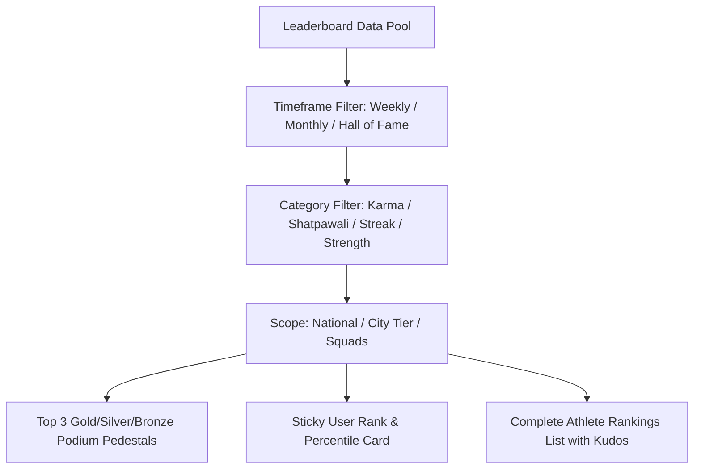

# Weekly / Monthly Leaderboards (Sadhana Shreshthata Board)

## 1. Overview & Cultural Philosophy
The **Weekly / Monthly Leaderboards** feature (`LeaderboardScreen`) redefines fitness competition. Moving away from burnout-inducing calorie or extreme cardio metrics, FitKarma ranks athletes based on **Holistic Sadhana Consistency**, **Shatpawali Compliance**, **Autonomic Recovery**, and **Balanced Karma Velocity**.

---

## 2. Visual Architecture & Component Flow

### Key UI Sections:
- **Timeframe & Category Filter Chips**:
  - Timeframes: `Weekly Sprint (Saptahik)`, `Monthly Endurance (Masik)`, `Hall of Fame (Sthirata)`.
  - Categories: `Overall Karma Velocity`, `Shatpawali Compliance`, `Habit Streak Longevity`, `Relative Strength Tonnage`.
- **Top 3 Podium Pedestals Bento**:
  - Visual pedestals displaying Gold (#1), Silver (#2), and Bronze (#3) crowns, avatar badges, and karma scores.
- **Sticky User Rank Hero Card**:
  - Highlights user's current standing (`#4`), percentile ([`GlowingMetric`](file:///f:/fitkarma/lib/shared/widgets/glowing_metric.dart) `Top 0.01%`), and points needed to reach the next rank tier.
- **Leaderboard Rankings List**:
  - Full sorted list with location tags, Karma tiers, and interactive Kudos reactions.

---

## 3. Mathematical Foundations

### Percentile Rank Formula:
$$\text{Percentile} = \left(1.0 - \frac{\text{Rank} - 1}{N_{\text{total\_athletes}}}\right) \times 100$$

### Score Gap to Next Rank:
$$\Delta_{\text{points}} = \text{Score}_{\text{rank}-1} - \text{Score}_{\text{user}}$$

---

## 4. Source Files Reference
- **Domain Models**: [`lib/features/social/domain/leaderboard_models.dart`](file:///f:/fitkarma/lib/features/social/domain/leaderboard_models.dart)
- **Deterministic Engine**: [`lib/features/social/domain/leaderboard_engine.dart`](file:///f:/fitkarma/lib/features/social/domain/leaderboard_engine.dart)
- **State Provider**: [`lib/features/social/presentation/providers/leaderboard_provider.dart`](file:///f:/fitkarma/lib/features/social/presentation/providers/leaderboard_provider.dart)
- **UI Screen**: [`lib/features/social/presentation/leaderboard_screen.dart`](file:///f:/fitkarma/lib/features/social/presentation/leaderboard_screen.dart)

---

## 5. Offline Verification & Security Rules
- **100% Offline Capability**: All percentile calculations, gap derivations, and podium layouts render offline with pure Dart arithmetic.
- **Firestore Security Rules**: Protected under `/leaderboards/{leaderboardKey}` (read-only for authenticated clients, written by backend Cloud Functions).
