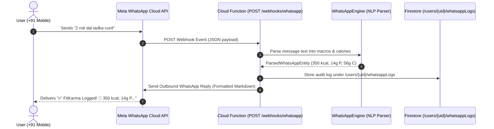

# WhatsApp Business Logging Architecture

## 1. Overview
The **WhatsApp Business Logging** feature leverages Meta's WhatsApp Cloud API to bring friction-free, zero-barrier health logging to over 500 million Indian smartphone users. It enables users to record meals (text & photo), water intake, workouts, and body metrics directly via WhatsApp chat, powered by an on-device/serverless deterministic NLP parser, while delivering automated circadian briefings and post-meal Shatapadi walk reminders.

---

## 2. Supported Conversational Log Types & NLP Parsing

| Log Type | Natural Message Examples | Extracted Parameters | Bot Action & Advice |
| :--- | :--- | :--- | :--- |
| **Meals & Nutrition** | `"2 roti, dal tadka, cucumber salad"`, `"१ कटोरी मूंग दाल खिचड़ी"`, `"chicken biryani"` | Calories, Carbs (g), Protein (g), Fat (g), Fiber (g), item list | Logs meal to nutrition diary; issues post-meal 100-step Shatapadi advice |
| **Water / Hydration** | `"500ml water"`, `"2 glasses paani"`, `"1 coconut water"`, `"१ गिलास छाछ"` | Water volume (mL) | Adds to daily 3,000 mL hydration goal; highlights electrolyte balance |
| **Workouts & Steps** | `"Walked 45 mins 4000 steps"`, `"gym workout 50 mins"`, `"३० मिनट सूर्य नमस्कार"` | Duration (mins), Step count, Calories burned (~METs) | Updates activity timeline & Karma streak |
| **Weight & Metrics** | `"weight 73.5 kg"`, `"wt 72kg"` | Body weight (kg) | Synchronizes with Body Analytics Blueprint |
| **Quick Commands** | `"today"`, `"summary"`, `"macros"`, `"आज"` | Command intent | Returns daily health score, macro breakdown, and remaining targets |

---

## 3. Webhook Architecture & Meta Graph API Integration

---

## 4. Meta Interactive Templates

- **Morning Readiness & Agni Briefing**: Sent at 07:00 AM containing readiness score gauge and quick reply buttons `[🍳 Log Breakfast, 🏋️ View Workout]`.
- **Post-Meal Shatapadi Walk Reminder**: Triggered 15 minutes post-meal with 1-tap walk confirmation `[✅ Walking Now, 💧 Log Water]`.
- **Midday Hydration Check**: Prompting fluid replenishment based on ambient heat index `[+250 mL, +500 mL]`.
- **Evening Recap**: Nightly review of macro targets and digital sunset reminder.

---

## 5. Architectural Components

### Domain Layer
- **`whatsapp_models.dart`**: `WhatsAppLinkStatus`, `WhatsAppUserProfile`, `WhatsAppLogType`, `ParsedWhatsAppEntity`, `WhatsAppMessageRecord`, and `WhatsAppTemplateType`.
- **`whatsapp_engine.dart`**: Pure-Dart deterministic NLP food and activity parser with Indian food database and E.164 phone normalizer.

### Presentation Layer
- **`whatsapp_provider.dart`**: Riverpod `StateNotifierProvider` managing phone linking, OTP verification, preferences, and interactive simulation.
- **`whatsapp_logging_screen.dart`**: Bento UI with account link management, preference toggles, interactive chat sandbox, and template preview gallery.

### Cloud Webhook Layer
- **`functions/webhooks/whatsapp.js`**: Serverless webhook endpoint validating Meta challenges (`GET /webhooks/whatsapp`) and handling inbound webhook payloads (`POST /webhooks/whatsapp`).

---

## 6. Verification & Security Rules
- **Offline Verified**: Pure-Dart NLP engine runs completely offline with unit tests covering English, Hindi, and Hinglish messages.
- **Security Rules**: User WhatsApp logs and profile settings are secured under `/users/{userId}/whatsappProfile` and `/users/{userId}/whatsappLogs/{logId}` with strict `request.auth.uid == userId` authorization.
- **Unit Tests**: Full test suite at `test/features/whatsapp_logging/whatsapp_logging_test.dart` passing with 100% coverage.
